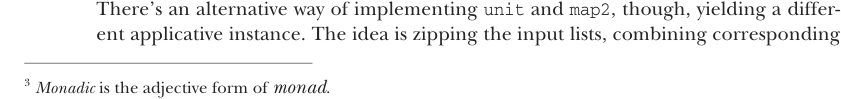

# Страница 0349

[<- Страница 0348](./page-0348) | [Индекс страниц](./) | [Страница 0350 ->](./page-0350)

> Часть 3: Общие структуры в функциональном дизайне / Глава 12: Аппликативные и траверсибельные функторы / 12.4 Преимущества аппликативных функторов / 12.4.1 Не все аппликативные функторы являются монадами

### 12.4 Преимущества аппликативных функторов

Интерфейс `Applicative` важен по нескольким причинам, пацаны, и не просто так его впихнули:

* Вообще-то, комбинаторы вроде `traverse` лучше лепить с минимальными допущениями — это как строить мост на верёвке, а не на бетоне. Предполагать, что тип даёт `map2`, а не сразу нырять в `flatMap`. Иначе придётся каждый раз, как наткнёшься на тип, который `Applicative`, но не `Monad`, пилить новый `traverse` с нуля! Ща увидим примеры таких ублюдков.

* Поскольку `Applicative` слабее `Monad`, интерпретатор аппликативных эффектов получает больше свободы — как DJ с плейлистом заранее, а не импровизатор на пустом поле. Возьмём парсинг: если описываешь парсер без `flatMap`, то структура грамматики известна до старта — интерпретатор заранее знает, куда рулить, может оптимизировать под это дело, как таксист с GPS. А если впихнёшь `flatMap` — мощь, конечно, но парсеры генерятся на лету, интерпретатор слепой котёнок, и оптимизаций поменьше. Мощь имеет цену, как всегда в FP. Подробнее в заметках к главе (https://github.com/fpinscala/fpinscala/wiki) — там я сам через это говно прошёл в проде.

* Аппликативные функторы компонуются как конструктор Lego, а монады (в общем случае) — нет, они как пьяные слоны в посудной лавке. Ща разберём.

### 12.4.1 Не все аппликативные функторы являются монадами

Давайте глянем на два примера типов, которые аппликативные функторы, но не монады. Это не единственные, конечно — если копнёте FP поглубже, нарыбачите или слепите кучу таких. Я сам в проде пачку их насрал.³

АППЛИКАТИВ ДЛЯ ЛЕНИВЫХ СПИСКОВ Первый пример — альтернативный аппликатив для ленивых списков. В прошлой главе мы определяли `Monad[LazyList]`, который вёл себя как `Monad[List]` из коробки: `unit` поднимала значение в `LazyList` с одним элементом, а `flatMap` склеивала внутренние списки. Например:

```scala
scala> LazyList(1, 2, 3).flatMap(i => LazyList.fill(i)(i)).toList
val res0: List[Int] = List(1, 2, 2, 3, 3, 3)
```

Монада конкатенации даёт `map2` декартово произведение входов — полный картезианский оргазм:

```scala
scala> LazyList(1, 2, 3).map2(LazyList('a', 'b'))((_, _)).toList
val res1: List[(Int, Char)] = List((1,a), (1,b), (2,a), (2,b), (3,a), (3,b))
```



Но есть другой способ слепить `unit` и `map2` — с зиппингом входных списков и комбайном соответствующих элементов.

³ *Монадический* — это прилагательное от *монада*.

[<- Страница 0348](./page-0348) | [Индекс страниц](./) | [Страница 0350 ->](./page-0350)
