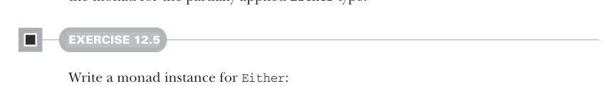

# Страница 0351
[<- Страница 0350](./page-0350) | [Индекс страниц](./) | [Страница 0352 ->](./page-0352)

> Часть 3: Общие структуры в функциональном дизайне / Глава 12: Аппликативные и проходимые функторы / 12.4 Преимущества аппликативных функторов / 12.4.1 Не все аппликативные функторы — монады

## `Validated`: вариант `Either`, который накапливает ошибки, как сборщик багов

В главе 4 мы ковырялись с типом данных `Either` и ломали голову, как его доработать, чтоб он мог вываливать пачку ошибок разом, а не одну за раз. Конкретный пример — валидация формы на веб-сайте. Если выдавать только первую херню, юзер будет как лох переотправлять форму по разу, фикся по одной ошибке. Вот такая классическая засада с `Either`, если юзать его в монадическом стиле. Давай сперва реально набросаем монаду для частично применённого типа `Either`.



#### УПРАЖНЕНИЕ 12.5

Напиши инстанс монады для `Either`:

```scala
given eitherMonad[E]: Monad[Either[E, _]] with
  def unit[A](a: => A): Either[E, A] = ???

extension [A](fa: Either[E, A])
  def flatMap[B](f: A => Either[E, B]): Either[E, B] = ???
```

Теперь представь цепочку вызовов `flatMap` типа такой, где функции `validName`, `validBirthdate` и `validPhone` каждая имеет тип `Either[String, T]` для заданного типа `T`:

```scala
validName(field1).flatMap(f1 =>
  validBirthdate(field2).flatMap(f2 =>
    validPhone(field3).map(f3 => WebForm(f1, f2, f3))
  )
)
```

Если `validName` наебнётся с ошибкой, то `validBirthdate` и `validPhone` даже не взлетят — короткое замыкание, как в дешёвом реле. Вычисление с `flatMap` по умолчанию строит линейную цепочку зависимостей, будто домино в ряд: одно упало — всё пошло на хуй. Переменная `f1` никогда не привяжется ни к чему, покуда `validName` не прокатит. А теперь то же самое, но с `map3`:

```scala
validName(field1).map3(
  validBirthdate(field2),
  validPhone(field3)
)(WebForm(_, _, _))
```

Здесь между тремя выражениями, кинутыми в `map3`, никакой жёсткой зависимости не намечено — они как параллельные потоки в реакторе, и в теории можно собрать все ошибки из каждого `Either` в общую кучу `List`. Но если юзать монаду `Either`, то её реализация `map3` через `flatMap` встанет колом после первой же ошибки — типичный монадический fail-fast (сбой на первой ошибке), как в императивном коде с исключениями (exceptions). В главе 4 мы слепили тип `Validated` именно для накопления ошибок (используем финальную версию `Validated`, где ошибка — это одно значение типа `E`). Давай заново его пропишем здесь:

```scala
enum Validated[+E, +A]:
  case Valid(get: A)
  case Invalid(error: E)
```

[<- Страница 0350](./page-0350) | [Индекс страниц](./) | [Страница 0352 ->](./page-0352)
