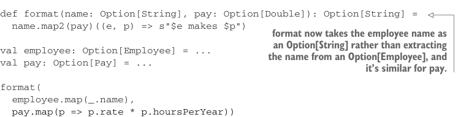

# Страница 0357
[<- Страница 0356](./page-0356) | [Индекс страниц](./) | [Страница 0358 ->](./page-0358)

> Часть 3: Общие структуры в функциональном дизайне / Глава 12: Аппликативные и траверсибельные функторы / 12.5 Законы аппликатива / 12.5.3 Натуральность произведения

Здесь мы лепим трансформацию прямо на результат `map2` — из `Employee` выдираем имя, из `Pay` — годовую зэпэшку. Но можно так же без напряга применить эти выдиралки по отдельности до вызова `format`, подкинув ему `Option[String]` и `Option[Double]` вместо `Option[Employee]` и `Option[Pay]`. Это вполне адекватный рефакторинг, чтоб `format` не парился о внутренностях этих типов данных — чистый интерфейс, как в нормальном коде.

**Листинг 12.7. Рефакторинг `format`**



```scala
def format(name: Option[String], pay: Option[Double]): Option[String] =
name.map2(pay)((e, p) => s"$e makes $p")
```

> Теперь `format` жрёт имя сотрудника как `Option[String]`, а не ковыряется в `Option[Employee]`, и с оплатой та же херня.

```scala
val employee: Option[Employee] = ...
val pay: Option[Pay] = ...
format(
employee.map(_.name),
pay.map(p => p.rate * p.hoursPerYear))
```

Мы применяем трансформацию для выдергивания полей `name` и `pay` ещё до `map2`. Ожидаем, что программа значит ровно то же самое, что и раньше; такой паттерн лезет из всех щелей в реальной жизни. С эффектами `Applicative` всегда есть выбор: лепить map'ы до склейки в `map2` или после. Закон натуральности орёт: пох, результат один хрен. Формально это так:

```scala
fa.map2(fb)((a, b) => (f(a), g(b))) == fa.map(f).product(fb.map(g))
```

Законы аппликатива — не какая-то mind-blowing хуйня из параллельной вселенной, и не шокируют. Точь-в-точь как законы монад: простые чеклисты, чтоб аппликативный функтор не подставил и работал предсказуемо, как нормальный пацан. Они гарантируют, что `unit`, `map` и `map2` пляшут в унисон, без подколов.


#### УПРАЖНЕНИЕ 12.7

*Сложное*: Докажите, что все монады — аппликативные функторы, показав, что если законы монад держатся, то реализации `map2` и `map` в `Monad` удовлетворяют законам аппликатива.


#### УПРАЖНЕНИЕ 12.8

Как мы берём продукт двух монад `A` и `B`, чтоб слепить монаду `(A, B)`, так и тут — продукт двух аппликативных функторов. Внедрите эту функцию в трейт `Applicative`:

[<- Страница 0356](./page-0356) | [Индекс страниц](./) | [Страница 0358 ->](./page-0358)
