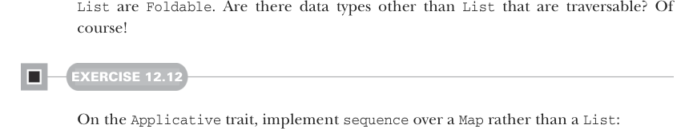
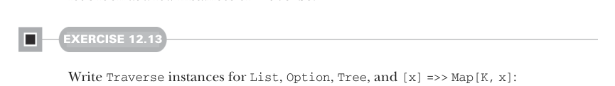

# Страница 0359
[<- Страница 0358](./page-0358) | [Индекс страниц](./) | [Страница 0360 ->](./page-0360)

> Часть 3: Общие структуры в функциональном дизайне / Глава 12: Аппликативные и траверсибельные функторы / 12.6 Траверсибельные функторы



`List` — это `Foldable` (складываемый). А есть ли другие типы данных помимо `List`, которые траверсибельные? Конечно, блядь, их как грибов после дождя!

#### EXERCISE 12.12

На трейте `Applicative` реализуй `sequence` поверх `Map`, а не `List`:

```scala
def sequenceMap[K, V](ofv: Map[K, F[V]]): F[Map[K, V]]
```

Но траверсибельных типов — пиздец сколько, не на каждый же индивидуальные `sequence` и `traverse` методы городить, как будто у тебя жизнь вечная. 
Нам нужна новая абстракция — окрестим её `Traverse`[^7]:

```scala
trait Traverse[F[_]]:
  extension [A](fa: F[A])
    def traverse[G[_]: Applicative, B](f: A => G[B]): G[F[B]] =
      fa.map(fp).sequence
  extension [G[_]: Applicative, A](fga: F[G[A]])
    def sequence: G[F[A]] =
      fga.traverse(ga => ga)
```

Самая вкусная хуйня тут — `sequence`. Взгляни на сигнатуру повнимательнее, как на код-ревью у токсичного лида. 
Берёт `F[G[A]]` и меняет местами `F` с `G`, при условии, что `G` — аппликативный функтор (applicative functor). 
Это чистая алгебраическая чертовщина, абстрактная как философия Хайдеггера; ща разберём по косточкам, что к чему, но сперва глянем пару инстансов `Traverse`, чтоб не в облаках парить.



#### EXERCISE 12.13

Напиши инстансы `Traverse` для `List`, `Option`, `Tree` и `[x] => Map[K, x]`:

```scala
case class Tree[+A](head: A, tail: List[Tree[A]])
```

Теперь у нас инстансы для `List`, `Option`, `Map` и `Tree`. 
А что значит этот обобщённый `traverse`/`sequence` на деле, а не на бумаге? 
Давай подставим конкретику в сигнатуры вызовов `sequence` и погадаем, как цыганка, что они мутят по типам:

- `List[Option[A]]` `=>` `Option[List[A]]` (вызов `Traverse[List].sequence` с `Option` как `Applicative`) возвращает `None`, если хоть один входной `Option` — `None`; иначе выдаёт `Some` с `List` всех значений из входных `Option`.

[^7]: Имя `Traversable` уже занято каким-то левым трейтом в стандартной либе Скалы.

[<- Страница 0358](./page-0358) | [Индекс страниц](./) | [Страница 0360 ->](./page-0360)
