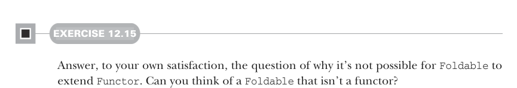

# Страница 0362
[<- Страница 0361](./page-0361) | [Индекс страниц](./) | [Страница 0363 ->](./page-0363)

> Часть 3: Общие структуры в функциональном дизайне / Глава 12: Аппликативные и обходные функторы / 12.7 Применение Traverse / 12.7.2 Обходы со State

## 333 12.7 К чему этот Traverse



#### УПРАЖНЕНИЕ 12.15

Убедись сам, нахуя это не катит, чтоб `Foldable` расширял `Functor`. Прикинь `Foldable`, который вообще не функтор (functor)?

Так а `Traverse` на самом деле для чего? Мы уже видели реальные кейсы с конкретными инстансами — типа список парсеров в парсер, который выдаёт список, — но когда эта обобщалка выстреливает? Какую библиотеку на стероидах позволяет слепить `Traverse`?

### 12.7.2 Обходы со State

Аппликатив `State` — это вообще зверь мощный, как танк в FP-арсенале. Берём `State`-действие для `traverse` коллекции — и вуаля, лепим сложные обходы с внутренним стейтом, который мутирует под капотом. На демке — `State`-обход, который проставляет позицию каждому элементу, как нумерация в старом добром Excel, только без слёз. Держим `int`-стейт с нуля, инкрементим на каждом шаге. Заметь, реализация жрёт готовый инстанс `Applicative[State[S, _]]` — без него никуда.

**Listing 12.9** Нумерация элементов в `Traversable`

```scala
extension [A](fa: F[A])
  def zipWithIndex: F[(A, Int)] =
    fa.traverse(a =>
      for
        i <- State.get[Int]
        _ <- State.set(i + 1)
      yield (a, i)
    ).run(0)(0)
```

Эта хрень работает на `List`, `Tree` или любом другом `Traversable` — универсал, блядь. Идём дальше по этой тропе: держим стейт типа `List[A]` и превращаем любой `Traversable` функтор прямиком в `List`. Как по маслу.

**Listing 12.10** `Traversable` в список

```scala
extension [A](fa: F[A])
  def toList: List[A] =
    fa.traverse(a =>
      for
        as <- State.get[List[A]]
        _  <- State.set(a :: as)
      yield ()
    ).run(Nil)(1).reverse
```


> Хватаем текущий стейт — накопленный список.
>
> Добавляем текущий элемент и пихаем новый список как свежий стейт.

[<- Страница 0361](./page-0361) | [Индекс страниц](./) | [Страница 0363 ->](./page-0363)
