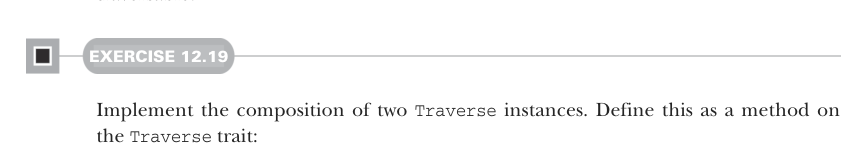

# Страница 0365

[<- Страница 0364](./page-0364) | [Индекс страниц](./) | [Страница 0366 ->](./page-0366)

> Часть 3: Общие структуры в функциональном дизайне /  
> Глава 12: Аппликативные и траверсибельные функторы /  
> 12.7 Применения Traverse /  
> 12.7.6 Композиция монад

### 12.7.4 Слияние траверсалов

Помните в пятой главе, как мы ковырялись с несколькими проходами по структуре и сплавили их в один жирный? А в десятой — продукты монад для того, чтоб над фолдабельной хренью несколько вычислений за один свайп прогнать, без лишнего дрочильна. Теперь с продуктами аппликативных функторов (applicative functors) та же хуйня: несколько траверсалов по траверсибельной структуре сливаем в один проход, как в хорошем fusion-реакторе.


#### УПРАЖНЕНИЕ 12.18

Используй продукты аппликативных функторов, чтоб слепить два траверсала в один. Эта функция берёт две хуйни `f` и `g`, проносится по `fa` ровно один раз и собирает результаты обеих сразу в карман. Определи это как extension-метод на трейте `Traverse`:

```scala
extension [A](fa: F[A])
def fuse[M[_]: Applicative, N[_]: Applicative, B](
f: A => M[B], g: A => N[B]
): (M[F[B]], N[F[B]])
```

### 12.7.5 Вложенные траверсалы

Не только аппликативы компонуются для слияния траверсалов — сами траверсибельные функторы (traversable functors) компонуются, как матрёшка в аду. Если у тебя вложенная хрень типа `Map[K, Option[List[V]]]`, то траверсишь мапу, опцию и лист одновременно, и без гемора добираешься до `V` внутри, потому что `Map`, `Option` и `List` все траверсибельные, блядь.



#### УПРАЖНЕНИЕ 12.19

Реализуй композицию двух инстансов `Traverse`. Определи это методом на трейте `Traverse`:

```scala
def compose[G[_]: Traverse]: Traverse[[x] =>> F[G[x]]] = ???
```

### 12.7.6 Композиция монад

Теперь вернёмся к заёбу с композицией монад. Как мы видели раньше в этой главе, `Applicative` всегда компонуется на ура, а вот `Monad` — нет, сука, не всегда. Если раньше пробовал реализовать общую композицию монад, то на `join` для вложенных `F` и `G` упёрся бы в тип вроде `F[G[F[G[A]]]] => F[G[A]]` — и это хуйня, которую не напишешь в общем виде. Но если у `G` ещё и `Traverse` есть, то `sequence` превращает `G[F[_]]` в `F[G[_]]`, и вуаля — `F[F[G[G[A]]]]`. Дальше джойнишь соседние `F` и `G` слои по их монад-инстансам, и привет, чистая композиция.

[<- Страница 0364](./page-0364) | [Индекс страниц](./) | [Страница 0366 ->](./page-0366)
