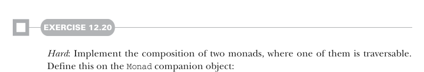
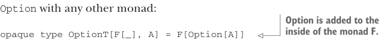

# Страница 0366
[<- Страница 0365](./page-0365) | [Индекс страниц](./) | [Страница 0367 ->](./page-0367)

> Часть 3: Общие структуры в функциональном дизайне / Глава 12: Аппликативные и траверсибельные функторы / 12.8 Заключение

## 337 12.8 Заключение



#### УПРАЖНЕНИЕ 12.20

*Сложное*: Реализуй композицию двух монад, где одна из них траверсибельная. Определи это в companion object'е `Monad`:

```scala
def composeM[G[_]: Monad, H[_]: Monad: Traverse]: Monad[[x] =>> G[H[x]]] =
???
```

Экспрессивность и мощь иногда бьют по карману композициональностью и модульностью — классика, блядь, как в жизни. Проблему склеивания монад обычно лепят на коленке кастомной версией каждой монады, заточенной чисто под эту херню. Это говно зовётся *monad transformer*. Взять хотя бы трансформер `OptionT` — он компонует `Option` с любой другой монадой, как конструктор Лего из ада:



> Option засовывается внутрь монады F, как матрёшка в матрёшку.

```scala
opaque type OptionT[F[_], A] = F[Option[A]]
object OptionT:
def apply[F[_], A](fa: F[Option[A]]): OptionT[F, A] = fa
extension [F[_], A](o: OptionT[F, A])
def value: F[Option[A]] = o
given optionTMonad[F[_]](using F: Monad[F]): Monad[OptionT[F, _]] with
def unit[A](a: => A): OptionT[F, A] = F.unit(Some(a))
extension [A](fa: OptionT[F, A])
override def flatMap[B](f: A => OptionT[F, B]): OptionT[F, B] =
F.flatMap(fa):
case None => F.unit(None)
case Some(a) => f(a).value
```

Определение `flatMap` тут мапит по `F` и `Option`, а потом сплющивает структуры вроде `F[Option[F[Option[A]]]]` в скромненький `F[Option[A]]`. Но это всё заточено под `Option`, а общая схема с использованием `Traverse` прокатывает только с траверсибельными функторами — остальные в пролёте. Чтобы слепить что-то с `State` (которую хрен траверсируешь), приходится пилить специализированный трансформер `StateT`. Универсального способа склеить любые монады нет, увы — это не мем с "one does not simply". За деталями про трансформеры монад загляни в заметки к главе (https://github.com/fpinscala/fpinscala/wiki).

### 12.8 Заключение

В этой главе мы откопали две новые годные абстракции — `Applicative` и `Traverse`, — просто поковырявшись в сигнатурах нашего старого доброго интерфейса `Monad`, как в старом баг-трекере. Аппликативные функторы — это менее выебистая, но куда более композиционная обобщалка монад, чтоб не мучаться с flatMap'ами везде. Функции `unit` и `map` поднимают значения и функции на уровень, а `map2` с `apply` дают пиздец как мощно аппликативить функции с кучей аргументов. Траверсибельные функторы — это когда мы обобщили `sequence` и `traverse`, которые мелькали перед глазами чаще, чем кофе в офисе. Вместе-то они,

[<- Страница 0365](./page-0365) | [Индекс страниц](./) | [Страница 0367 ->](./page-0367)
