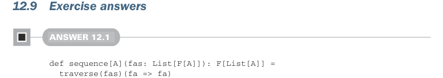

# Страница 0368

[<- Страница 0367](./page-0367) | [Указатель страниц](./) | [Страница 0369 ->](./page-0369)

> Часть 3: Общие структуры в функциональном дизайне / Глава 12: Аппликативные и траверсибельные функторы / 12.9 Ответы на упражнения

## 339 Ответы на упражнения 12.9

- Тип `Validated` — это альтернатива `Either`, которая ошибки копит в кучку, как строгий бухгалтер все косяки в тетрадку, а не сливает при первом же. У `Validated` аппликатив есть, монада — фиг там, и то хорошо, меньше соблазна в монадный ад скатиться.

- `Semigroup` — это обобщение `Monoid` без обязательного юнита, типа semigroup без пустой банки, чтоб комбайнить элементы без лишней отмазки про нейтралку.

- Все монады — семигруппы, но не все семигруппы монады, классика, как все коты — животные, а не наоборот.

- У дата-типа `NonEmptyList` есть инстанс `Semigroup`, но `Monoid` — нету, и это не баг, а фича, чтоб не плодить сущностей.

- Траверсибельные функторы позволяют компоновать аппликативные эффекты с разными паттернами итераций, без необходимости пилить спецлогику под каждый эффект — как универсальный конвейер, куда кидаешь что угодно.

- Инстанс `Traverse` задаётся реализацией либо `traverse`, либо пары `map` и `sequence` — выбирай, что ближе к твоему безумию.

- Операция `sequence` конвертит `F[G[A]]` в `G[F[A]]`, меняя местами `F` и `G`, если есть инстансы `Traverse[F]` и `Applicative[G]` — чистый трюк для переворота мира.

- Операция `traverse` берёт `F[A]` и `A => G[B]`, возвращает `G[F[B]]` при наличии инстансов `Traverse[F]` и `Applicative[G]` — как аппликативный миксер для структур.

- Любой `fa.map(f).sequence` можно записать как `fa.traverse(f)`, и наоборот — симметрия, как в хорошем танце.

- Все траверсибельные — и функторы, и фолдаблы. Но не все функторы траверсибельны, и не все фолдаблы — тоже, типичный подвох FP, где половина кажется универсальной, а на деле — херня.

- Траверсинг с типом `State` позволяет выразить кучу стейтфул-вычислений, вроде `zipWithIndex` и `mapAccum` — как чит-код для мутабельного ада в чистом стиле.

- Аппликативы компонуются на ура, монады — нет (в общем случае). Два аппликатива слепишь в новый аппликатив без конкретики типов — чистая магия.

- Некоторые монады компонуются с другими произвольными монадами, часто через монад-трансформеры — конкретный тип лепишь с другой монадой, и вуаля, составная монада.

- Монад-трансформер `OptionT` — пример: даёт спецмонаду для `F[Option[A]]` при любой монадической `F[_]`. А `OptionT` позволяет зумить на внутренний `A`, отодвигая эффекты `Option` и `F` на задний план — как камера в кино.



### 12.9 Ответы на упражнения

#### РЕШЕНИЕ 12.1

```scala
def sequence[A](fas: List[F[A]]): F[List[A]] =
traverse(fas)(fa => fa)
def traverse[A,B](as: List[A])(f: A => F[B]): F[List[B]] =
as.foldRight(unit(List[B]()))((a, acc) => f(a).map2(acc)(_ :: _))
```

[<- Страница 0367](./page-0367) | [Указатель страниц](./) | [Страница 0369 ->](./page-0369)
