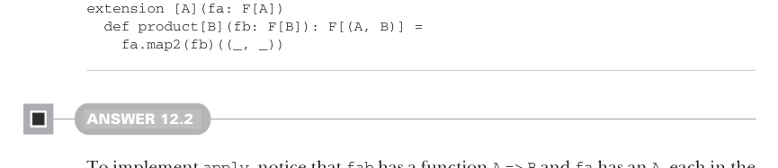

# Страница 0369
[<- Страница 0368](./page-0368) | [Индекс страниц](./) | [Страница 0370 ->](./page-0370)

> Часть 3: Общие структуры в функциональном дизайне / Глава 12: Аппликативные и траверсибельные функторы / Ответы на упражнения 12.9

```scala
def replicateM[A](n: Int, fa: F[A]): F[List[A]] =
  sequence(List.fill(n)(fa))
```



```scala
extension [A](fa: F[A])
  def product[B](fb: F[B]): F[(A, B)] =
    fa.map2(fb)((_, _))
```

#### ОТВЕТ 12.2

Чтобы заимплементить `apply`, глянь: `fab` тащит функцию `A => B`, а `fa` несёт `A` — всё это в эффекте `F`, как в консервной банке. 
Пихаем `fab` и `fa` в `map2`, выковыриваем эти внутренние сокровища и клеим `A` к функции `A => B` — бац, и готово:

```scala
def apply[A, B](fab: F[A => B])(fa: F[A]): F[B] =
  fab.map2(fa)((f, a) => f(a))
```

Для `map` поднимаем чистую функцию `f: A => B` в `F` через `unit` — вуаля, у нас `F[A => B]` в кармане. 
Потом суём это дело вместе с `F[A]` в `apply` и ловим финальный `F[B]`:

```scala
extension [A](fa: F[A])
  def map[B](f: A => B): F[B] =
    apply(unit(f))(fa)
```

`map2` — это уже хардкор, пацаны, как debug'ить монаду в продакшене ночью. 
Сначала каррируем функцию `f`, чтоб вышла `A => B => C`. 
Потом задираем эту хрень в эффект `F` через `unit` — получаем `F[A => B => C]`. 
Далее аппликация с `apply` и `fa` сворачивает до `F[B => C]`. 
И напоследок пихаем этот `F[B => C]` вместе с `F[B]` в `apply` — и вуаля, нужный `F[C]` на блюдечке:

```scala
def map2[B, C](fb: F[B])(f: (A, B) => C): F[C] =
  apply(
    apply(unit(f.curried))(fa)
  )(fb)
```

Кстати, внутренний `apply(unit(f.curried))(fa)` можно тупо заменить на `fa.map(f.curried)` — это ж чистое определение `map`, без дураков.


#### ОТВЕТ 12.3

Паттерн накатывает в `map` и `map2` из прошлого упражнения, как баг в legacy-коде, который сам себя фиксит. 
Продлеваем его на `map3`, `map4` и дальше по списку. 
За каждый доп. параметр — ещё один слой `apply` снаружи, как луковицу чистим в обратку:

```scala
extension [A](fa: F[A])
  def map3[B, C, D](
    fb: F[B],
    fc: F[C]
  )(f: (A, B, C) => D): F[D] =
    apply(apply(apply(unit(f.curried))(fa))(fb))(fc)

  def map4[B, C, D, E](
    fb: F[B],
    fc: F[C],
    fd: F[D]
  )(f: (A, B, C, D) => E): F[E] =
    apply(apply(apply(apply(unit(f.curried))(fa))(fb))(fc))(fd)
```

[<- Страница 0368](./page-0368) | [Индекс страниц](./) | [Страница 0370 ->](./page-0370)
