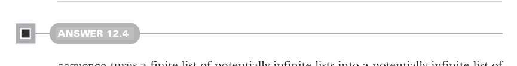

```yaml
---
title: "Страница 0370"
outline: false
---
```

# Страница 0370

[<- Страница 0369](./page-0369) | [Индекс страниц](./) | [Страница 0371 ->](./page-0371)

> Часть 3: Общие структуры в функциональном дизайне / Глава 12: Аппликативные и траверсибельные функторы / 12.9 Ответы на упражнения

## 341 12.9 Ответы на упражнения

```scala
)(f: (A, B, C) => D): F[D] =
apply(apply(apply(unit(f.curried))(fa))(fb))(fc)
def map4[B, C, D, E](
fb: F[B],
fc: F[C],
fd: F[D]
)(f: (A, B, C, D) => E): F[E] =
apply(apply(apply(apply(unit(f.curried))(fa))(fb))(fc))(fd)
```

Можем сделать это чуток яснее — `mapN` тупо пихается через `apply` и `map(N - 1)`, но для арности 3+ уже не разгонишься с `f.curried`, синтаксис превращается в помойку, как код после дедлайна, когда все на нервах.

```scala
extension [A](fa: F[A])
def map[B](f: A => B): F[B] =
apply(unit(f))(fa)
def map2[B, C](fb: F[B])(f: (A, B) => B): F[C] =
apply(fa.map(f.curried))(fb)
def map3[B, C, D](
fb: F[B],
fc: F[C]
)(f: (A, B, C) => D): F[D] =
apply(fa.map2(fb)((a, b) => f(a, b, _)))(fc)
def map4[B, C, D, E](
fb: F[B],
fc: F[C],
fd: F[D]
)(f: (A, B, C, D) => E): F[E] =
apply(fa.map3(fb, fc)((a, b, c) => f(a, b, c, _)))(fd)
```



#### Ответ 12.4

`sequence` берёт конечный список потенциально бесконечных стримов и вываливает из него потенциально бесконечный список конечных листов — как транспонирование матрицы, где ряды короткие, а колонки тянутся в вечность. Сначала отстреливает всех первых элементов из инпутов, потом всех вторых, и так далее, покуда какой-нибудь коротконогий не кончится и не обрушит всю вечеринку.


#### Ответ 12.5

```scala
given eitherMonad[E]: Monad[Either[E, _]] with
def unit[A](a: => A): Either[E, A] = Right(a)
extension [A](fa: Either[E, A])
def flatMap[B](f: A => Either[E, B]): Either[E, B] =
```

[<- Страница 0369](./page-0369) | [Индекс страниц](./) | [Страница 0371 ->](./page-0371)
