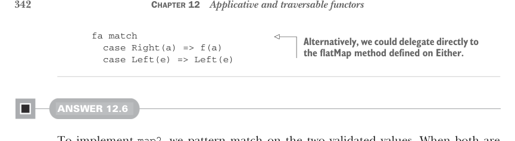
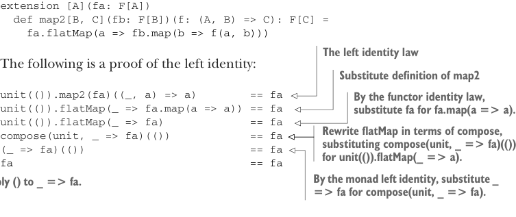

# Страница 0371
[<- Страница 0370](./page-0370) | [Индекс страниц](./) | [Страница 0372 ->](./page-0372)

> Часть 3: Общие структуры в функциональном дизайне / Глава 12: Аппликативные и траверсибельные функторы / 12.9 Ответы на упражнения



```scala
fa match
case Right(a) => f(a)
case Left(e) => Left(e)
```

> Или просто свалить всю хуйню на flatMap из Either, без лишних телодвижений — классика, когда лень ковыряться.

#### ОТВЕТ 12.6

Чтобы завести `map2`, матчим по двум валидированным значениям,  
как по двум пьяным корешам на код-ревью.  

Оба в теме — апплайим поданную ф-ю и оборачиваем результат в `Valid`,  
чтоб не потерялся.  

Оба в говне — склеиваем ошибки через данную `Monoid[E]`,  
типа "давайте, братаны, объединим ваши фейлы в эпик фейл";  
а если один в говне — возвращаем его, без сантиментов,  
чтоб не плодить лишних мутантов:

```scala
enum Validated[+E, +A]:
case Valid(get: A) extends Validated[Nothing, A]
case Invalid(error: E) extends Validated[E, Nothing]
object Validated:
given validatedApplicative[E: Monoid]: Applicative[Validated[E, _]] with
def unit[A](a: => A) = Valid(a)
extension [A](fa: Validated[E, A])
override def map2[B, C](fb: Validated[E, B])(f: (A, B) => C) =
(fa, fb) match
case (Valid(a), Valid(b)) => Valid(f(a, b))
case (Invalid(e1), Invalid(e2)) =>
Invalid(summon[Monoid[E]].combine(e1, e2))
case (e @ Invalid(_), _) => e
case (_, e @ Invalid(_)) => e
```


#### ОТВЕТ 12.7

Нам надо доказать, что все аппликативные законы держатся,  
когда мы лепим `map2` на базе `flatMap`:  
левая идентичность, правая, ассоциативность и натурализм.  
Берем это определение `map2`, чтоб не выдумывать велосипед:

```scala
extension [A](fa: F[A])
def map2[B, C](fb: F[B])(f: (A, B) => C): F[C] =
```



```scala
fa.flatMap(a => fb.map(b => f(a, b)))
```

> Закон левой идентичности

Вот пруф левой идентичности, шаг за шагом,  
как в пьяной тусовке разбираем, почему код не компилится:

> Подставляем определение map2

```scala
unit(()).map2(fa)((_, a) => a)
== fa
unit(()).flatMap(_ => fa.map(a => a)) == fa
unit(()).flatMap(_ => fa)
== fa
compose(unit, _ => fa)(())
== fa
(_ => fa)(())
== fa
fa
== fa
```

> По закону идентичности функтора, заменяем fa.map(a => a) на fa — ну а чё, оно само себя любит.

> Переписываем flatMap через compose, подставляя compose(unit, _ => fa)(()) вместо unit(()).flatMap(_ => a) — типо, "давай, unit, роди мне fa".

> По левой идентичности монады, _ => fa вместо compose(unit, _ => fa). Апплайим () к _ => fa — и вуаля, чистота.

[<- Страница 0370](./page-0370) | [Индекс страниц](./) | [Страница 0372 ->](./page-0372)
