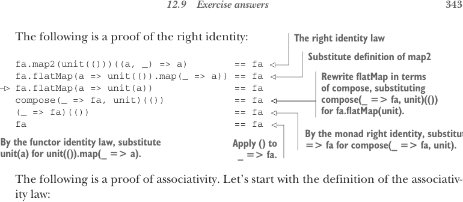
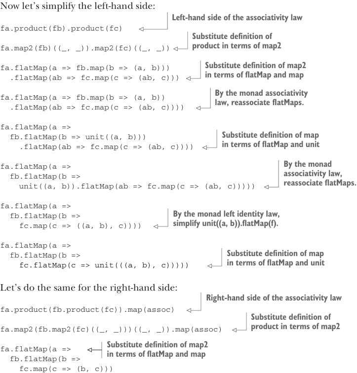

# Страница 0372
[<- Страница 0371](./page-0371) | [Индекс страниц](./) | [Страница 0373 ->](./page-0373)

> Часть 3: Общие структуры в функциональном дизайне / Глава 12: Аппликативные и траверсибельные функторы / 12.9 Ответы на упражнения



## 343 Ответы на упражнения 12.9

Вот доказательство правой идентичности — чтоб не было, блядь, сомнений, как это сходится на практике:

> **Закон правой идентичности**

```scala
fa.map2(unit(()))((a, _) => a) == fa
fa.flatMap(a => unit(()).map(_ => a)) == fa
fa.flatMap(a => unit(a)) == fa
compose(_ => fa, unit)(()) == fa
(_ => fa)(()) == fa
fa == fa
```

> Перепишем `flatMap` через `compose`, подставив `compose(_ => fa, unit)(())` вместо `fa.flatMap(unit)`.
>
> По правой идентичности монады подставляем `_ => fa` вместо `compose(_ => fa, unit)`. Применяем `()` к `_ => fa`.
>
> По закону идентичности функтора подставляем `unit(a)` вместо `unit(()).map(_ => a)`.

А теперь ассоциативность — это как матрёшка в монадах, разворачиваем слой за слоем. Начнём с определения закона ассоциативности:

```scala
fa.product(fb).product(fc) == fa.product(fb.product(fc)).map(assoc)
```



Упростим левую сторону — шаг за шагом, как на код-ревью, чтоб все видели подвохи:

> **Левая сторона закона ассоциативности**

```scala
fa.product(fb).product(fc)
```

> Подставляем определение `product` через `map2`

```scala
fa.map2(fb)((_, _)).map2(fc)((_, _))
```

> Подставляем определение `map2` через `flatMap` и `map`

```scala
fa.flatMap(a => fb.map(b => (a, b)))
  .flatMap(ab => fc.map(c => (ab, c)))
```

> По закону ассоциативности монады переассоциируем `flatMap`-ы

```scala
fa.flatMap(a => fb.map(b => (a, b))
  .flatMap(ab => fc.map(c => (ab, c))))
fa.flatMap(a =>
  fb.flatMap(b => unit((a, b)))
    .flatMap(ab => fc.map(c => (ab, c))))
```

> Подставляем определение `map` через `flatMap` и `unit`.
>
> По закону ассоциативности монады переассоциируем `flatMap`-ы

```scala
fa.flatMap(a =>
  fb.flatMap(b =>
    unit((a, b)).flatMap(ab =>
      fc.map(c => (ab, c))
    )
  )
)
fa.flatMap(a =>
  fb.flatMap(b =>
    fc.map(c => ((a, b), c))
  )
)
```

> По левому закону идентичности монады упрощаем `unit((a, b)).flatMap(f)`

```scala
fa.flatMap(a =>
  fb.flatMap(b =>
```

> Подставляем определение `map` через `flatMap` и `unit`

```scala
    fc.flatMap(c => unit(((a, b), c)))))
```

То же самое проделаем с правой стороной — симметрия, как в хорошем FP, без сюрпризов:

> **Правая сторона закона ассоциативности**

```scala
fa.product(
  fb.product(fc)
).map(assoc)
```

> Подставляем определение `product` через `map2`

```scala
fa.map2(
  fb.map2(fc)((_, _))
)((_, _))
  .map(assoc)
```

> Подставляем определение `map2` через `flatMap` и `map`

```scala
fa.flatMap(a =>
  fb.flatMap(b =>
    fc.map(c => (b, c)))
```

[<- Страница 0371](./page-0371) | [Индекс страниц](./) | [Страница 0373 ->](./page-0373)
