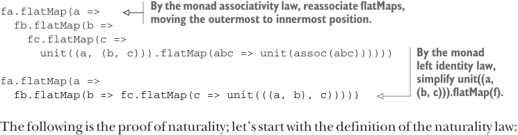
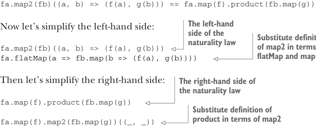

# Страница 0373

[<- Страница 0372](./page-0372) | [Индекс страниц](./) | [Страница 0374 ->](./page-0374)

> Часть 3: Общие структуры в функциональном дизайне / Глава 12: Аппликативные и траверсибельные функторы / 12.9 Ответы на упражнения


```scala
fa.flatMap(a =>
  fb.flatMap(b =>
    fc.map(c => (b, c)))
    .map(bc => (a, bc)))
  .map(assoc)
```

> Подставляем определение map через flatMap и unit

```scala
fa.flatMap(a =>
  fb.flatMap(b =>
    fc.flatMap(c => unit((b, c))))
    .map(bc => (a, bc)))
  .map(assoc)
```

> Подставляем определение map через flatMap и unit

```scala
fa.flatMap(a =>
  fb.flatMap(b =>
    fc.flatMap(c => unit((b, c))))
    .flatMap(bc => unit((a, bc))))
  .map(assoc)
```

> По закону ассоциативности монад переассоциируем flatMap'ы

```scala
fa.flatMap(a =>
  fb.flatMap(b =>
    fc.flatMap(c => unit((b, c)))
      .flatMap(bc => unit((a, bc)))))
  .map(assoc)
```

> По закону ассоциативности монад переассоциируем flatMap'ы

```scala
fa.flatMap(a =>
  fb.flatMap(b =>
    fc.flatMap(c => unit((b, c))
      .flatMap(bc => unit((a, bc))))))
  .map(assoc)
```

> По закону левой идентичности монад упрощаем unit((b, c)).flatMap(f)

```scala
fa.flatMap(a =>
  fb.flatMap(b =>
    fc.flatMap(c => unit((a, (b, c))))))
  .map(assoc)
```

> Подставляем определение map через flatMap и unit

```scala
fa.flatMap(a =>
  fb.flatMap(b =>
    fc.flatMap(c => unit((a, (b, c))))))
  .flatMap(abc => unit(assoc(abc)))
```



> По закону ассоциативности монад переассоциируем flatMap'ы, заталкивая внешний внутрь

```scala
fa.flatMap(a =>
  fb.flatMap(b =>
    fc.flatMap(c =>
      unit((a, (b, c))).flatMap(abc => unit(assoc(abc))))))
```

> По закону левой идентичности монад упрощаем unit((a, (b, c))).flatMap(f)

```scala
fa.flatMap(a =>
  fb.flatMap(b => fc.flatMap(c => unit(((a, b), c)))))
```

Вот доказательство натуралистичности; начнём с определения закона натуралистичности:

```scala
fa.map2(fb)((a, b) => (f(a), g(b))) == fa.map(f).product(fb.map(g))
```



> Левая часть закона натуралистичности. Подставляем определение map2 через flatMap и map

Теперь упростим левую часть:

```scala
fa.map2(fb)((a, b) => (f(a), g(b)))
fa.flatMap(a => fb.map(b => (f(a), g(b))))
```

Затем упростим правую часть:

> Правая часть закона натуралистичности

```scala
fa.map(f).product(fb.map(g))
```

> Подставляем определение product через map2

```scala
fa.map(f).map2(fb.map(g))((_, _))
```

[<- Страница 0372](./page-0372) | [Индекс страниц](./) | [Страница 0374 ->](./page-0374)
