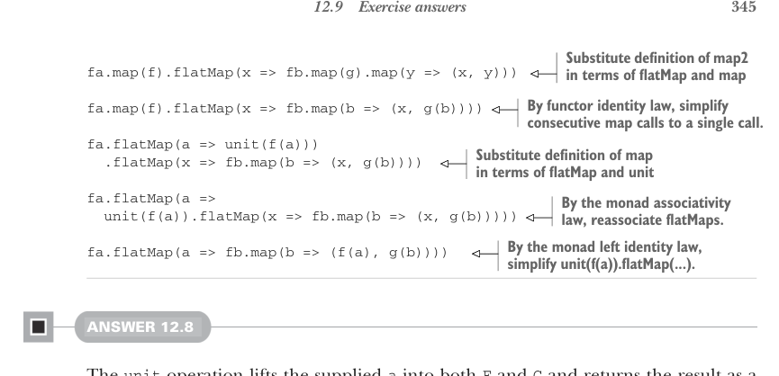
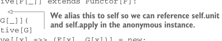
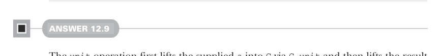

# Страница 0374
[<- Страница 0373](./page-0373) | [Индекс страниц](./) | [Страница 0375 ->](./page-0375)

> Часть 3: Общие структуры в функциональном дизайне / Глава 12: Аппликативные и траверсибельные функторы / 12.9 Ответы на упражнения



## 345 12.9 Ответы на упражнения

> Подставляем определение map2 через flatMap и map — как в старом добром рецепте, слой за слоем.

```scala
fa.map(f).flatMap(x => fb.map(g).map(y => (x, y)))
```

> По закону идентичности функтора сливаем последовательные map в один — чистим лишний мусор, чтоб не плодить сущностей.

```scala
fa.map(f)
  .flatMap(x => fb.map(b => (x, g(b))))

fa.flatMap(a => unit(f(a)))
  .flatMap(x => fb.map(b => (x, g(b))))
```

> Подставляем определение map через flatMap и unit — дальше по схеме.

```scala
fa.flatMap(a =>
  unit(f(a)).flatMap(x =>
    fb.map(b => (x, g(b)))
  )
)
```

> По закону ассоциативности монады переставляем flatMap'ы поудобнее, чтоб не запутаться в скобках.

> По закону левой идентичности монады упрощаем unit(f(a)).flatMap(...) — классика, чтоб не дёргаться зря.

```scala
fa.flatMap(a => fb.map(b => (f(a), g(b))))
```

#### Ответ 12.8

Операция `unit` поднимает переданную `a` сразу в оба мира — `F` и `G`, как дубликат в параллельные реальности, и возвращает результат парой на блюдечке. Операция `apply` жрёт пару функций — одну из `F`, другую из `G` — и пару значений `F[A]` с `G[A]`. Применяет `F[A => B]` к `F[A]`, а `G[A => B]` к `G[A]`, и опять пара на выходе — симметрия, блядь, как в матрице:

```scala
trait Applicative[F[_]] extends Functor[F]:
  self =>
    def product[G[_]](
      G: Applicative[G]
    ): Applicative[[x] =>> (F[x], G[x])] =
      new:
        def unit[A](a: => A) =
          (self.unit(a), G.unit(a))
        override def apply[A, B](
          fs: (F[A => B], G[A => B])
        )(p: (F[A], G[A])) =
          (self.apply(fs(0))(p(0)), G.apply(fs(1))(p(1)))
```



> Алиасим это на self, чтоб в анонимном инстансе не ебаться с this и хватать self.unit с self.apply по именам, как нормальные пацаны.



#### Ответ 12.9

Операция `unit` сначала поднимает переданную `a` в `G` через `G.unit`, а потом результат — уже в `F`, итого значение типа `F[G[A]]`. В отличие от 12.8, где мы ковыряли `apply`, тут берём `map2` как примитив — чтоб не плодить велосипеды. А `map2` клепаем вложенными вызовами `map2` на аппликативах `F` и `G` — матрёшка, сука, но работает как часы:

```scala
trait Applicative[F[_]] extends Functor[F]:
  self =>
    def compose[G[_]](G: Applicative[G]): Applicative[[x] =>> F[G[x]]] = new:
      def unit[A](a: => A) = self.unit(G.unit(a))
      extension [A](fga: F[G[A]])
        override def map2[B, C](fgb: F[G[B]])(f: (A, B) => C) =
          self.map2(fga)(fgb)(G.map2(_)(_)(f))
```

[<- Страница 0373](./page-0373) | [Индекс страниц](./) | [Страница 0375 ->](./page-0375)
