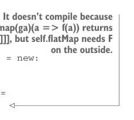

# Страница 0375
[<- Страница 0374](./page-0374) | [Индекс страниц](./) | [Страница 0376 ->](./page-0376)

> Часть 3: Общие структуры в функциональном дизайне / Глава 12: Аппликативные и траверсибельные функторы / 12.9 Ответы на упражнения


#### ОТВЕТ 12.10

Этот пруф лучше всего забабахать через автоматический proof assistant типа Coq или Agda — вручную тут будешь как муху в спидометре ковырять. Вот пруф на Coq: https://mng.bz/M2DQ.


#### ОТВЕТ 12.11

Забабахать `unit` — проще простого: сначала поднимаем `A` в `G[A]` с помощью поданной `Monad[G]`, а потом результат в `F[G[A]]` через `Monad[F]`. К сожалению, `flatMap` не взлетит ни хуя. Нам в итоге нужно добраться до значения `A`, чтоб применить к нему нашу функцию `f`. Как ни ковыряй — с любой стороны, — типы не сходятся, как в том меме с "it doesn't fit". В примере ниже мы `flatMap`аем внешний `F[G[A]]`, потом мапим внутренний `G[A]`, но остаёмся с типом, который наши комбинаторы на хуй не нужны — `G[F[G[B]]]`: 



> Не компилится, потому что `G.map(ga)(a => f(a))` возвращает `G[F[G[B]]]`, а `self.flatMap` требует `F` снаружи.

```scala
trait Monad[F[_]] extends Applicative[F]:
self =>
def compose[G[_]](G: Monad[G]): Monad[[x] =>> F[G[x]]] = new:
def unit[A](a: => A): F[G[A]] = self.unit(G.unit(a))
extension [A](fga: F[G[A]])
override def flatMap[B](f: A => F[G[B]]): F[G[B]] =
self.flatMap(fga)(ga => G.map(ga)(a => f(a)))
```

Можем вместо этого `flatMap`ать внутренний `G` — `self.flatMap(fga)(ga => G.flatMap(ga)(a => f(a)))`, — но опять `F` и `G` торчат не там, где надо, и переставить их нечем, блядь. `f(a)` возвращает `F[G[B]]`, а `G.flatMap` требует `G` снаружи. Если б мы могли как-то поменяться местами `F` и `G` — был бы пиздец как круто, — об этом позже, пацаны.


#### ОТВЕТ 12.12

Давайте фолдим по записям `Map`, стартуя с пустой мапы, поднятой в наш тип-конструктор через `unit`. На каждой итерации юзаем `map2`, чтоб слить значение записи типа `F[V]` с аккумулятором типа `Map[K, V]` — и вуаля, новая мапа с одной свежей записью, как в конвейере на заводе:

```scala
def sequenceMap[K, V](ofv: Map[K, F[V]]): F[Map[K, V]] =
ofv.foldLeft(unit(Map.empty[K, V])):
case (acc, (k, fv)) =>
acc.map2(fv)((m, v) => m + (k -> v))
```

[<- Страница 0374](./page-0374) | [Индекс страниц](./) | [Страница 0376 ->](./page-0376)
