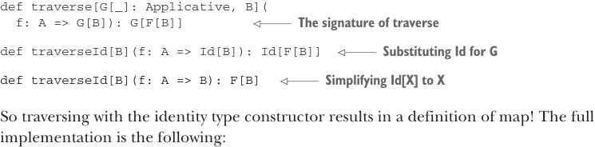

# Страница 0377
[<- Страница 0376](./page-0376) | [Индекс страниц](./) | [Страница 0378 ->](./page-0378)

> Часть 3: Общие структуры в функциональном дизайне / Глава 12: Аппликативные и траверсабельные функторы / 12.9 Ответы на упражнения

ставит перед нами аккумулятор типа `G[Map[K, B]]`, уже перелопаченное значение типа `G[B]` и ключ типа `K`. Берём `map2`, клеим его к аккумулятору и этому значению, и впихиваем свежую запись во внутреннюю мапу — связываем перелопаченное `B` с ключом `K`:

```scala
given mapTraverse[K]: Traverse[Map[K, _]] with
extension [A](m: Map[K, A])
override def traverse[G[_]: Applicative, B](
f: A => G[B]
): G[Map[K, B]] =
m.foldLeft(summon[Applicative[G]].unit(Map.empty[K, B])):
case (acc, (k, a)) =>
acc.map2(f(a))((m, b) => m + (k -> b))
def map[B](f: A => B): Map[K, B] =
m.map((k, a) => (k, f(a)))
```


#### ОТВЕТ 12.14

Давай сравним сигнатуру `map` с `traverse`, пацаны:

```scala
def map[B](f: A => B): F[B]
def traverse[G[_]: Applicative, B](f: A => G[B]): G[F[B]]
```

Заметим, что `traverse` похож на `map`, но впаривает лишний конструктор типов (type constructor) `G`. А если подобрать для `G` тип, чтоб этот конструктор испарился, как пар от кофе на код-ревью? Вспомним слегка подкрученную версию типа `Id` из прошлой главы, только теперь как type alias, а не case class — проще пареной репы:

```scala
type Id[A] = A
given idMonad: Monad[Id] with
def unit[A](a: => A) = a
extension [A](a: A)
override def flatMap[B](f: A => B): B = f(a)
```

Теперь подставим `Id` вместо `G` в сигнатуру `traverse`:



```scala
def traverse[G[_]: Applicative, B](
f: A => G[B]): G[F[B]]
```

> Сигнатура `traverse`

> Подставляем `Id` вместо `G`

```scala
def traverseId[B](f: A => Id[B]): Id[F[B]]
```

> Упрощаем `Id[X]` до `X`

```scala
def traverseId[B](f: A => B): F[B]
```

Короче, траверс с identity-конструктором типов (identity type constructor) вырождается в чистый `map` — как суперкар в режиме экономии бензина! Полная имплементация вот такая:

```scala
trait Traverse[F[_]] extends Functor[F]:
extension [A](fa: F[A])
def traverse[G[_]: Applicative, B](f: A => G[B]): G[F[B]] =
```

[<- Страница 0376](./page-0376) | [Индекс страниц](./) | [Страница 0378 ->](./page-0378)
