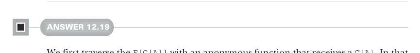

# Страница 0379

[<- Страница 0378](./page-0378) | [Индекс страниц](./) | [Страница 0380 ->](./page-0380)

> Часть 3: Общие структуры в функциональном дизайне / Глава 12: Аппликативные и траверсибельные функторы / 12.9 Ответы на упражнения

Перевёрнутый список для следующего элемента. Когда траверсал отработает до конца, состояние превратится в пустой список — и нахуй его, выкидываем:

```scala
extension [A](fa: F[A])
  def reverse: F[A] =
    fa.mapAccum(fa.toList.reverse)(
      (_, as) => (as.head, as.tail)
    )(0)
```


#### ОТВЕТ 12.17

`mapAccum` накапливает состояние, как `foldLeft`, и ещё по ходу выдаёт каждый преобразованный элемент, в отличие от `foldLeft`, которая просто жрёт и молчит. Чтобы закатать `foldLeft` через `mapAccum`, юзаем эту фичу с накоплением стейта и сразу выкидываем все накопленные преобразованные элементы. Нам нужен только финальный стейт, так что для каждого элемента возвращаем `()`, хотя похуй вообще, могли бы и `a`, `0`, `true` или любую другую хрень. Получившийся `F[Unit]` мы тут же сливаем в помойку:


> mapAccum здесь возвращает `(F[Unit], B)`, так что сливаем `F[Unit]` и берём чистый накопленный `B`.

```scala
extension [A](fa: F[A])
  override def foldLeft[B](acc: B)(f: (B, A) => B): B =
    fa.mapAccum(acc)((a, b) => ((), f(b, a)))(1)
```

#### ОТВЕТ 12.18

Чтобы замутить `fuse`, берём продукт инстансов `Applicative[M]` и `Applicative[N]`, а потом траверсим оригинальный инпут, пихая каждый элемент в оба — `f` и `g` — и склеивая результаты в пару. Приходится явно тип аппликатива указывать в траверсе, иначе Скала выведет какую-то другую хуйню вместо нужного конструктора:

```scala
extension [A](fa: F[A])
  def fuse[M[_], N[_], B](
    f: A => M[B],
    g: A => N[B]
  )(using
    m: Applicative[M],
    n: Applicative[N]
  ): (M[F[B]], N[F[B]]) =
    fa.traverse[[x] =>> (M[x], N[x]), B](a =>
      (f(a), g(a))
    )(using m.product(n))
```



#### ОТВЕТ 12.19

Сначала траверсим `F[G[A]]` анонимной функцией, которая ловит `G[A]`. Внутри неё траверсим уже `G[A]` с поданной функцией `f`, и выходит `H[G[B]]`. В итоге внешний траверс имеет тип `H[F[G[B]]]`: 

```scala
def compose[G[_]: Traverse]: Traverse[[x] =>> F[G[x]]] = new:
  extension [A](fga: F[G[A]])
```

[<- Страница 0378](./page-0378) | [Индекс страниц](./) | [Страница 0380 ->](./page-0380)
