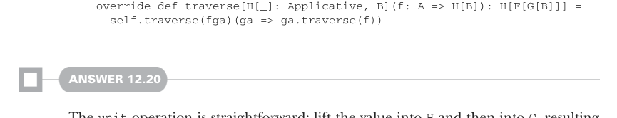

# Страница 0380

[<- Страница 0379](./page-0379) | [Индекс страниц](./) | [Страница 0381 ->](./page-0381)

> Часть 3: Общие структуры в функциональном дизайне / Глава 12: Аппликативные и траверсибельные функторы / 12.9 Ответы на упражнения

## 351 12.9 Ответы на упражнения



```scala
override def traverse[H[_]: Applicative, B](f: A => H[B]): H[F[G[B]]] =
self.traverse(fga)(ga => ga.traverse(f))
```

#### ОТВЕТ 12.20

Операция `unit` — проще пареной репы: поднимаем значение в `H`, а потом в `G`, и вуаля — чистенький `G[H[A]]`, как после хорошего рефакторинга. 

А вот `flatMap` — это уже хардкор, пацаны. Сначала `flatMap` этот заёбанный `gha: G[H[A]]`, то есть лепим анонимку, которая жрёт `H[A]` на входе. 

Потом `traverse` этот `H[A]` с поданной функцией `f` — и вываливается значение типа `G[H[H[B]]]`. 

Далее мапим по этому добру и `join` все внутренние `H`-слои в один сплошной `H`-пирог, чтоб не размазывалось по стенкам:


> Приходится явно дёргать G.flatMap и G.map, а то ненароком подцепишь методы расширения (extension methods) из этого композитного монстра.

```scala
def composeM[G[_], H[_]](
using G: Monad[G], H: Monad[H], T: Traverse[H]
): Monad[[x] =>> G[H[x]]] = new:
def unit[A](a: => A): G[H[A]] = G.unit(H.unit(a))
extension [A](gha: G[H[A]])
override def flatMap[B](f: A => G[H[B]]): G[H[B]] =
G.flatMap(gha)(ha => G.map(T.traverse(ha)(f))(H.join))
```

[<- Страница 0379](./page-0379) | [Индекс страниц](./) | [Страница 0381 ->](./page-0381)
