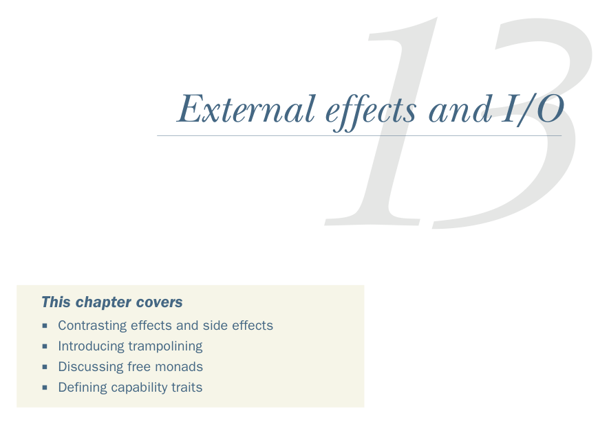

# Страница 0384
[<- Страница 0383](./page-0383) | [Индекс страниц](./) | [Страница 0385 ->](./page-0385)

> Часть 4: Эффекты и I/O / Глава 13: Внешние эффекты и I/O

## Внешние эффекты и I/O

### В этой главе разберём

- Разницу между эффектами и сайд-эффектами (effects vs side effects — не одно и то же, пацаны)
- Трамполинг — батут для стека, чтоб хвостовая рекурсия не ебнула OutOfMemory
- Фри-монды, чтоб интерпретатор сам решал, как твои абстракции воплощать
- Трейты возможностей (capability traits) — как ключи от машины, а не универсальный доступ ко всему

В этой главе возьмём всё, что уже нарыли про монады и алгебраические типы данных, и приделаем к ним хуи для *внешних эффектов* — типа копаться в базах данных или срать в файлы. Разработаем монаду для I/O, которая по делу зовётся `IO`, чтоб такие внешние приколы обрабатывать чисто функционально, без мутации состояния по углам. Здесь чётко разграничим эффекты от сайд-эффектов — эффекты это когда описываешь, что хочешь, а сайды это когда мир меняется незаметно, как вирус в проде. Монада `IO` даёт простой способ впихнуть императивный I/O-код в чистую программу, сохраняя референциальную прозрачность — ссылка на функцию всегда ведёт к тому же, без сюрпризов. Она жёстко отделяет *эффектный* код — тот, что трогает внешний мир, — от остальной логики, чтоб не было спагетти из мутаций. Это классическая фишка для внешних эффектов: чистые функции генерят *описание* эффектного вычисления (типа AST для твоей программы), а потом отдельный интерпретатор это разгоняет и реально делает дело. По сути, лепим embedded DSL (EDSL) для императивщины — как если бы Scala позволяла писать C-стиль, но без боли в жопе.

**355**

[<- Страница 0383](./page-0383) | [Индекс страниц](./) | [Страница 0385 ->](./page-0385)
