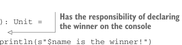

# Страница 0385
[<- Страница 0384](./page-0384) | [Индекс страниц](./) | [Страница 0386 ->](./page-0386)

> Часть 4: Эффекты и I/O / Глава 13: Внешние эффекты и I/O / 13.1 Факторинг эффектов

программирование. Это охуенно мощная техника, которую мы будем юзать весь остаток части 4, чтоб не тонуть в imperative болоте. Наша цель — накачать вас скиллами, чтоб вы сами лепили свои EDSL (embedded domain-specific language) для описания программ с эффектами, как боги FP, а не как мудаки с `println` везде.

### 13.1 Факторинг эффектов

Подходим к монаде `IO` снизу вверх, начиная с простого примера программы с сайд-эффектами — классика, через которую все мы прошли, когда код был сплошным `println("пиздец")`.

**Листинг 13.1. Программа с сайд-эффектами**

```scala
case class Player(name: String, score: Int)
def contest(p1: Player, p2: Player): Unit =
  if p1.score > p2.score then
    println(s"${p1.name} is the winner!")
  else if p2.score > p1.score then
    println(s"${p2.name} is the winner!")
  else
    println("It's a draw.")
```

Функция `contest` склеивает I/O-код для показа результата с чистой логикой подсчёта победителя — типичный грех, как сиамские близнецы, которых надо разъединить. Можем вынести логику в отдельную чистую функцию — `winner`, чтоб она сияла в вакууме, без примесей:


```scala
def winner(p1: Player, p2: Player): Option[Player] =
  if p1.score > p2.score then Some(p1)
  else if p1.score < p2.score then Some(p2)
  else None
```

> Содержит логику подсчёта победителя или ничьей — чистая, как слеза девственницы



> Несёт ответственность за объявление победителя в консоли — вся грязная I/O-работа на ней

```scala
def contest(p1: Player, p2: Player): Unit =
  winner(p1, p2) match
    case Some(Player(name, _)) => println(s"$name is the winner!")
    case None => println("It's a draw.")
```

Всегда можно разложить impure процедуру на чистую core-функцию и две с сайдами: одну, что подкидывает инпут чистой (как feeder в CI/CD), и вторую, что ковыряется с аутпутом (как consumer в Kafka). В листинге 13.1 мы выдернули чистую `winner` из `contest`. Концептуально, `contest` тащила две хуйни на себе: считать результат матча и его выводить — классический god object, помните те времена? После рефакторинга `winner` фокусируется на одной ответственности: считать победителя, как sniper. А метод `contest` держит печать результата `winner` в консоль — separation of concerns в чистом виде, пацаны на код-ревью бы поаплодировали.

Можем копнуть глубже, рефакторить дальше. Функция `contest` всё ещё таскает две ответственности: придумать, какое сообщение выводить, и его напечатать — как frontend-бэкендер в одном флаконе, хаос. Выносим чистую функцию для генерации сообщения, и вуаля: если завтра захотим в UI запихнуть или в файл слить (а не в эту чёртову консоль), то вообще без боли переключимся. Давай сделаем этот рефакторинг прямо сейчас, чтоб почувствовать кайф чистоты:

[<- Страница 0384](./page-0384) | [Индекс страниц](./) | [Страница 0386 ->](./page-0386)
