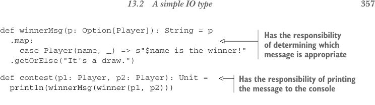

# Страница 0386

[<- Страница 0385](./page-0385) | [Индекс страниц](./) | [Страница 0387 ->](./page-0387)

> Часть 4: Эффекты и I/O / Глава 13: Внешние эффекты и I/O / 13.2 Простой тип IO



## 357 13.2 Простой тип IO

```scala
def winnerMsg(p: Option[Player]): String = p
.map:
case Player(name, _) => s"$name is the winner!"
.getOrElse("It's a draw.")
```

> Несёт ответственность за выбор подходящего сообщения

```scala
def contest(p1: Player, p2: Player): Unit =
```

> Несёт ответственность за вывод сообщения в консоль

```scala
println(winnerMsg(winner(p1, p2)))
```

Обратите внимание, как побочка в виде `println` теперь торчит только в самом внешнем слое программы, а внутри вызова `println` — чистое выражение, без всякой грязи. Пример на пальцах, но принцип бьёт в жирные продакшн-монстры так же чётко, и вы, пацаны, наверняка просекаете, как такой рефакторинг ложится как влитой. Мы не меняем, что делает наша прогa, просто перекладываем её внутренности по полочкам в мелкие функции. Ключевая фишка здесь: внутри любой функции с побочками прячется чистая функция, которая рвётся на волю, как шаман из матрицы. Давайте это формализуем по-взрослому. Берм impure-функцию `f` типа `A` `=>` `B` и рвём `f` на две:

- Чистую функцию типа `A` `=>` `D`, где `D` — это такая дескрипция результата `f`, типа blueprint'а.

- Impure-функцию типа `D` `=>` `B` — интерпретатор этих дескрипций, который и пачкает руки.

Скоро растянем это на инпуты. А пока представьте, как мы это повторяем по программе: каждый раз чистим функции, выталкивая побочки наружу. Эти impure-штуки — как *императивная скорлупа* вокруг чистого ядра, мем про onion architecture в чистом виде. В итоге упираемся в builtin'ы вроде `println` типа `String` `=>` `Unit`, которые вроде как обязаны мутить побочки. И чё дальше, бро?

### 13.2 Простой тип IO

Оказывается, даже такие процедуры, как `println`, мутят не одну херню. Их тоже можно разобрать по винтикам, введя новый дата-тип под ником `IO`:

```scala
trait IO:
def unsafeRun: Unit
def PrintLine(msg: String): IO = new:
def unsafeRun = println(msg)
def contest(p1: Player, p2: Player): IO =
PrintLine(winnerMsg(winner(p1, p2)))
```

Теперь наша `contest` чистая, как слеза девственницы; возвращает `IO`-значение — чистый план действий, дескрипшн, который не исполняется на месте. Говорим, что `contest` имеет (или производит) эффект, effectful она, но реально пачкается только интерпретатор `IO` — её метод `unsafeRun`.1 Теперь `contest` отвечает только за одно, что

1 Префикс `unsafe` юзаем, чтоб отличить интерпретатор от других методов без побочек.

[<- Страница 0385](./page-0385) | [Индекс страниц](./) | [Страница 0387 ->](./page-0387)
