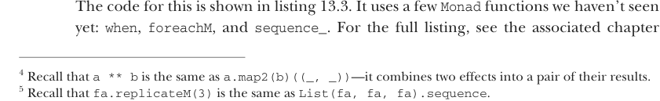

# Страница 0389
[<- Страница 0388](./page-0388) | [Индекс страниц](./) | [Страница 0390 ->](./page-0390)

> Часть 4: Эффекты и I/O / Глава 13: Внешние эффекты и I/O / 13.2 Простой тип IO / 13.2.1 Обработка эффектов ввода

```scala
def unit[A](a: => A): IO[A] = IO(a)
extension [A](fa: IO[A])
override def flatMap[B](f: A => IO[B]) =
fa.flatMap(f)
```

Теперь можно замутить наш пример с ``converter``, пацаны, без всякой хуйни:

```scala
def ReadLine: IO[String] = IO(readLine())
def PrintLine(msg: String): IO[Unit] = IO(println(msg))
def converter: IO[Unit] = for
_ <- PrintLine("Enter a temperature in degrees Fahrenheit: ")
d <- ReadLine.map(_.toDouble)
_ <- PrintLine(fahrenheitToCelsius(d).toString)
yield ()
```

Определение ``converter`` теперь чистое, как слеза младенца — никаких сайд-эффектов, сплошная референциальная прозрачность, описание вычисления с эффектами на бумажке. А ``converter.unsafeRun`` — это интерпретатор, который в реальной жизни эти эффекты и отработает, не ссы. И раз ``IO`` — полноценная ``Monad``, то все монадические комбинаторы из прошлых сеансов в деле, compose'им как хотим. Вот ещё примерчики, как ``IO`` юзать:

- ``val`` ``echo`` ``=`` ``ReadLine.flatMap(PrintLine)`` — ``IO[Unit]``, которая строку из консоли жрёт и эхом обратно выплевывает, попугай хуев

- ``val`` ``readInt`` ``=`` ``ReadLine.map(_.toInt)`` — ``IO[Int]``, которая ``Int`` парсит, строку из консоли слопав

- ``val`` ``readInts`` ``=`` ``readInt`` ``**`` ``readInt`` — ``IO[(Int,`` ``Int)]``, которая ``(Int,`` ``Int)`` парсит, две строки из консоли слопав^4

- ``ReadLine.replicateM(10)`` — ``IO[List[String]]``, которая 10 строк из консоли сожрёт и список результатов вернёт^5

Давай замахнёмся на покруче — интерактивная прога, которая в лупе юзера за ввод дёргает, как назойливый телемаркетер, и факториал его числа крутит. Вот как это в рантайме отжигает:

```scala
The Amazing Factorial REPL, v2.0
q - quit
<number> - compute the factorial of the given number
<anything else> - crash spectacularly
3
factorial: 6
7
factorial: 5040
q
```



Код в листинге 13.3. Там пара новых фичек из ``Monad``, которых ещё не видели: ``when``, ``foreachM`` и ``sequence_`. Полный разбор — в главе, не ссы.

^4 Вспомни, ``a ** b`` — это синоним ``a.map2(b)((_, _))``, два эффекта в тьюпл лепит.  
^5 ``fa.replicateM(3)`` = ``List(fa, fa, fa).sequence``, короче.

[<- Страница 0388](./page-0388) | [Индекс страниц](./) | [Страница 0390 ->](./page-0390)
