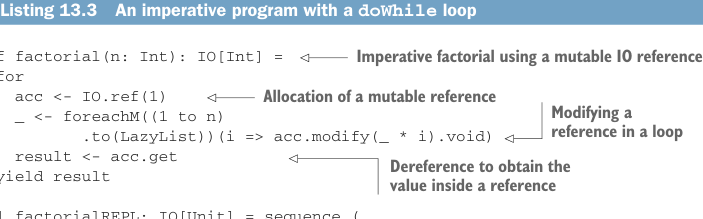
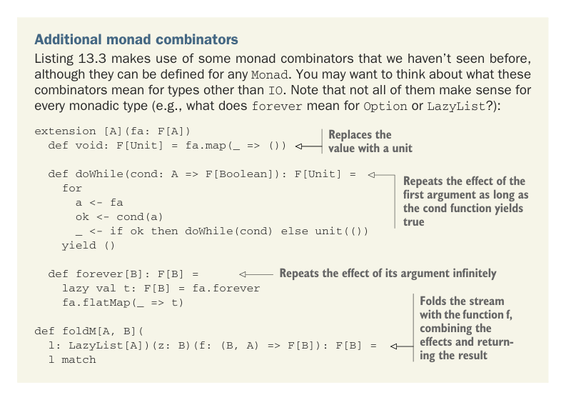

# Страница 0390

[<- Страница 0389](./page-0389) | [Оглавление страниц](./) | [Страница 0391 ->](./page-0391)

> Часть 4: Эффекты и I/O / Глава 13: Внешние эффекты и I/O / 13.2 Простой тип IO / 13.2.1 Обработка входных эффектов

## 361 13.2 Простой тип IO

Код. Подробности этой хуйни не принципиальны, пацаны; фишка в том, чтоб показать, как мы можем запихнуть императивный язык прямиком в чистый функциональный анклав Scala — типа, как турбореактив в велосипед засунуть, чтоб не рвануло. Все ваши любимые мутабельные приблуды на месте: циклы крутим, I/O ебашим, вся эта постимперская ностальгия.

Листинг 13.3 Императивная программа с циклом `doWhile`



> Императивный факториал на мутабельной ссылке IO

```scala
def factorial(n: Int): IO[Int] =
  for
    acc <- IO.ref(1)
    _ <- foreachM((1 to n).to(LazyList))(i => acc.modify(_ * i).void)
    result <- acc.get
  yield result
```

> Выделение мутабельной ссылки

> Модификация ссылки в цикле

> Разыменование, чтоб выковырять значение из ссылки

```scala
val factorialREPL: IO[Unit] = sequence_(
  PrintLine(helpstring),
  ReadLine.doWhile: line =>
    val ok = line != "q"
    when(ok):
      for
        n <- factorial(line.toInt)
        _ <- PrintLine("factorial: " + n)
      yield ()
)
```



Дополнительные комбинаторы монады. Листинг 13.3 юзает пару монадных комбинаторов, которых мы раньше не видали, но их запросто определяешь для любого `Monad[F]` (Monad) — как универсальный нож швейцарский для монад. Подумайте-ка, что они значат для типов помимо `IO` (IO), это как разминка для мозгов. Только учтите: не все они везде в тему (ну типа, что `forever` значит для `Option` (Option) или `LazyList` (LazyList)? — привет, edge-кейсы из ада):

```scala
extension [A](fa: F[A])
  def void: F[Unit] = fa.map(_ => ())
```

> Заменяет значение на `Unit` (unit) — чистый трэшакет

```scala
def doWhile(cond: A => F[Boolean]): F[Unit] =
  for
    a <- fa
    ok <- cond(a)
    _ <- if ok then
           doWhile(cond)
         else
           unit(())
  yield ()
```

> Повторяет эффект первого аргумента, пока `cond` не заорает `false` — классика `while`, только в FP-обёртке

> Повторяет эффект аргумента вечно — бесконечный луп, как ваш деплой в пятницу вечером

```scala
def forever[B]: F[B] =
  lazy val t: F[B] = fa.forever
  fa.flatMap(_ => t)
```

> Фолдит стрим функцией `f`, склеивая эффекты и возвращая результат — мощь, короче

```scala
def foldM[A, B](
l: LazyList[A])(z: B)(f: (B, A) => F[B]): F[B] =
  l match
```

[<- Страница 0389](./page-0389) | [Оглавление страниц](./) | [Страница 0391 ->](./page-0391)
