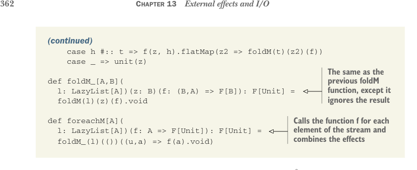

# Страница 0391

[<- Страница 0390](./page-0390) | [Индекс страниц](./) | [Страница 0392 ->](./page-0392)

> Часть 4: Эффекты и ввод-вывод / Глава 13: Внешние эффекты и I/O (ввод-вывод) / 13.2 Простой тип IO (ввод-вывод) / 13.2.2 Преимущества и недостатки простого типа IO



### (продолжение)

```scala
case h #:: t =>
  f(z, h).flatMap(z2 => foldM(t)(z2)(f))
case _ => unit(z)
```

> То же самое, что и предыдущая функция foldM, только игнорирует результат

```scala
def foldM_[A, B](
  l: LazyList[A]
)(
  z: B
)(
  f: (B, A) => F[B]
): F[Unit] =
  foldM(l)(z)(f).void

def foreachM[A](
  l: LazyList[A]
)(
  f: A => F[Unit]
): F[Unit] =
  foldM_(l)(())( (u, a) => f(a).void )
```

> Вызывает функцию f для каждого элемента потока и комбинирует эффекты

Мы не особо агитируем писать код вот так в Scala<sup>6</sup>. Но это чётко показывает: FP ни хуя не ссыт по выразительности — любую программу можно переписать чисто функционально, даже если это просто тупо императивный код, запиханный в монаду `IO`, как в матрёшку. Типа, прямолинейная эмуляция imperative-говна (императивного кода) в функциональной обёртке, и всё работает.

### 13.2.2 Преимущества и недостатки простого типа IO

Монада `IO`, как у нас пока, — это такой минимальный знаменатель для описания программ с внешними эффектами, типа LCD-монитора в подвале: работает, но не блещет. Её ценность в том, что она жёстко разграничивает чистый код от грязного, заставляя быть честным: "Вот тут, сука, мир снаружи лезет". Плюс подталкивает к тому факторингу эффектов, о котором мы раньше базарили — когда эффекты не плодятся как кролики, а собираются в аккуратные пачки. Но программировать внутри монады `IO` — это те же грабли, что и в обычном императивном аду: те же проблемы с композицией, те же головняки. Поэтому функциональные пацаны ищут способы покомпонуемее описывать эту effectful-хуйню (хуйню с эффектами)<sup>7</sup>. Тем не менее, наша монада `IO` даёт реальные плюшки:

- Вычисления `IO` — это обычные значения, блядь. Их можно в списки пихать, функциям скидывать, на лету генерить и так далее. Любую паттерн-рутину заворачиваешь в функцию — и переиспользуй, как самопал в подвале.

- Реификация вычислений `IO` как значений позволяет слепить интерпретатор поинтереснее, чем примитивный метод `run`, который запечён прямо в типе `IO`. Позже в главе мы соберём более отполированный `IO` и набросаем интерпретатор на неблокирующем I/O (ввод-выводе). Круче то, что меняем интерпретатор — а клиентский код, типа примера `converter`, остаётся нетронутым. Представление `IO` программисту вообще не светим! Это чисто деталь имплементации интерпретатора `IO`, как внутренности чёрного ящика.

<sup>6</sup> Если у тебя монолитный кусок impure-кода (кода с примесями), как этот, всегда можно просто написать дефинишн, который реально эффекты делает, а потом завернуть в `IO` — это эффективнее, и синтаксис слаще, чем комбо из for-comprehension (for-выражений) и всяких `Monad`-комбинаторов.<br>
<sup>7</sup> Пример увидим в главе 15, когда разовьём дата-тип для компонуемого стримингового I/O (ввода-вывод для потоков).

[<- Страница 0390](./page-0390) | [Индекс страниц](./) | [Страница 0392 ->](./page-0392)
