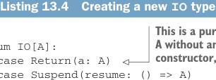

# Страница 0393
[<- Страница 0392](./page-0392) | [Индекс страниц](./) | [Страница 0394 ->](./page-0394)

> Часть 4: Эффекты и I/O / Глава 13: Внешние эффекты и I/O / 13.3 Избежание StackOverflowError / 13.3.1 Реификация потока управления как конструкторов данных

Реифицируем поток управления как конструкторы данных. Например, вместо того чтобы лепить `flatMap` методом, который через `unsafeRun` конструирует новый `IO` — как в том цирке с акробатами на стеке, — просто впихнём его как конструктор данных прямо в сам тип `IO`. А интерпретатор сделаем хвостово-рекурсивным лупом, чтоб стек не ебался. Наткнётся на `FlatMap(x, k)` — интерпретирует `x`, потом на результате `k` дергает, и по новой. Вот свежак `IO`, который эту идею воплощает в жизнь, без лишнего говна.

**Листинг 13.4. Создание нового типа `IO`**



> Это чистая вычисление, которая сразу кидает `A` и на этом всё, без дальнейших телодвижений. Когда `unsafeRun` узрит этот конструктор, поймёт: компьюташн финито, можно расслабиться.

```scala
enum IO[A]:
  case Return(a: A)
  case Suspend(resume: () => A)
  case FlatMap[A, B](
    sub: IO[A],
    k: A => IO[B]
  ) extends IO[B]
```


> Это приостановка компьютации, где `resume` — такая thunk-функция без аргументов, но с эффектом внутри, которая потом результат родит.


```scala
def flatMap[B](f: A => IO[B]): IO[B] =
  FlatMap(this, f)

def map[B](f: A => B): IO[B] =
  flatMap(a => Return(f(a)))
```

> Это композиция двух шагов. Реифицирует `flatMap` как конструктор данных, а не как полиморфную херню. Когда интерпретатор увидит это, сначала `sub` прогоняет, а потом, как `sub` родит результат, `k` цепляет и продолжает.

Этот новый `IO` имеет три конструктора данных, которые отражают три вида контроля потока, что интерпретатор этого типа должен поддерживать. `Return` — это когда IO-акшн уже допиздел, и мы просто возвращаем `a`, без дальнейшей хуйни. `Suspend` значит: ща какой-то эффект запустим, чтоб результат выдоить. А `FlatMap` позволяет цеплять продолжение: берём результат первой компьютации и на его основе вторую лепим. Реализация метода `flatMap` теперь просто дергает конструктор `FlatMap` и сваливает — интерпретатор сам разберётся. Увидит `FlatMap(sub, k)` — `sub` интерпретирует, результат запоминает, потом `k` на нём вызывает, и программа катит дальше. Добавим для удобства пару конструкторов-обёрток:


> Откладывает компьютацию `a` до момента, когда возвращённая программа интерпретируется.

```scala
object IO:
  def apply[A](a: => A): IO[A] =
    suspend(Return(a))
```

> Откладывает компьютацию программы `ioa` до момента, когда возвращённая программа интерпретируется.

```scala
def suspend[A](ioa: => IO[A]): IO[A] =
  Suspend(() => ioa).flatMap(identity)
```

Обратите внимание: определения `apply` и `suspend` **не вычисляют** свои by-name аргументы — откладывают на потом, до форсинга thunk'а (thunk) внутри внутреннего `Suspend`. Интерпретатор ща покажем, но сперва перепишем наш пример с `printLine` под этот новый `IO`:

[<- Страница 0392](./page-0392) | [Индекс страниц](./) | [Страница 0394 ->](./page-0394)
