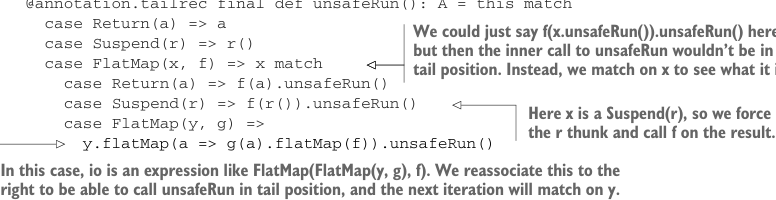
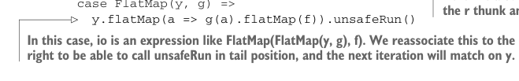

# Страница 0394
[<- Страница 0393](./page-0393) | [Индекс страниц](./) | [Страница 0395 ->](./page-0395)

> Часть 4: Эффекты и I/O / Глава 13: Внешние эффекты и I/O / 13.3 Избегание StackOverflowError (переполнения стека) / 13.3.1 Овеществление потока управления как конструкторов данных

## 365 13.3 Избегание StackOverflowError (переполнения стека)

```scala
def printLine(s: String): IO[Unit] =
  IO(println(s))

val p = printLine("Still going...").forever
```

То, что мы тут наворотили на самом деле — это бесконечная вложенная матрёшка, ну прям как `LazyList` в аду рекурсии. *Голова* стрима — чистый `Function0`, а весь остальной бардак с вычислениями — это *хвост*, который тянется в бесконечность:

```scala
FlatMap(
  FlatMap(
    Suspend(() => Return(println(s))),
    identity
  ),
  _ => FlatMap(
    FlatMap(
      Suspend(() => Return(println(s))),
      identity
    ),
    _ => FlatMap(...)
  )
)
```

А вот и хвост-реккурсивный интерпретатор, болтается методом на `IO`, шарится по этой матрёшке и дергает все эффекты по полной:

```scala
@annotation.tailrec final def unsafeRun(): A = this match
  case Return(a) => a
  case Suspend(r) => r()
  case FlatMap(x, f) => x match
    case Return(a) => f(a).unsafeRun()
    case Suspend(r) => f(r()).unsafeRun()
    case FlatMap(y, g) =>
```



> Мы могли бы тут просто заебать `f(x.unsafeRun()).unsafeRun()`, но тогда внутренний `unsafeRun` не встанет в хвостовую позицию, и привет, стек-оверфлоу. Вместо этого матчим на `x`, чтоб разобраться, что за хуйня внутри.

> Тут `x` — это `Suspend(r)`, так что форсим ленивый thunk (`thunk`) `r` и пихаем результат в `f`, чтоб не тормозить.



```scala
y.flatMap(a => g(a).flatMap(f)).unsafeRun()
```

> В этом случае `io` — это такая херня вроде `FlatMap(FlatMap(y, g), f)`. Мы её переассоциируем вправо, чтоб `unsafeRun` встал в хвост, и следующая итерация уже замэтчит на `y`.

Вместо того чтоб тупо пихать `f(x.unsafeRun()).unsafeRun()` в кейс `FlatMap(x, f)` (и проебать хвостовую рекурсию нахер), мы паттерн-матчим на `x` — она ж может быть только одной из трёх конструкторов, как в том меме про "три двери". Если `Return` — просто дергаем `f` на чистом значении внутри, без вопросов. Если `Suspend` — исполняем resumption, кидаем результат в `f` из внешнего `FlatMap` и рекурсим дальше. Но если `x` сама по себе `FlatMap`-конструктор, то мы знаем: `io` — это два `FlatMap`, слепленных слева, как левоассоциативный оператор в кошмаре: `FlatMap(FlatMap(y, g), f)`. Чтоб продолжить запуск, нам надо заглянуть в `y` — вдруг там ещё один `FlatMap`? Но глубина может быть любой, как рекурсия без хвоста, и мы хотим остаться хвост-реккурсивными, чтоб стек не обосрался. Переассоциируем вправо — и вуаля, `y.flatMap(g).flatMap(f)` превращается в `y.flatMap(a => g(a).flatMap(f))`. Используем закон ассоциативности монады, блядь, классика FP! Потом кидаем переписанное выражение в `unsafeRun` — и остаёмся в хвосте. Короче, когда интерпретируем программу, она потихоньку переписывается в правую ассоциативную цепочку `FlatMap`-конструкторов, и стек даже не чихнёт:

[<- Страница 0393](./page-0393) | [Индекс страниц](./) | [Страница 0395 ->](./page-0395)
