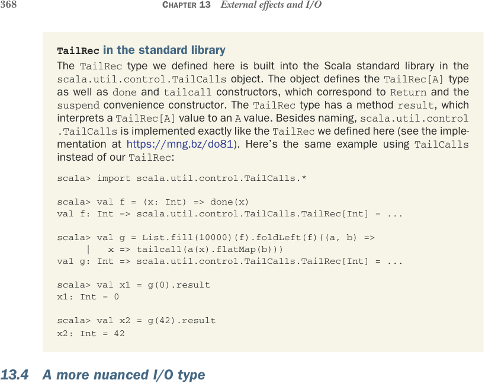

# Страница 0397
[<- Страница 0396](./page-0396) | [Индекс страниц](./) | [Страница 0398 ->](./page-0398)

> Часть 4: Эффекты и I/O / Глава 13: Внешние эффекты и I/O / 13.4 Более нюансированный тип I/O



### `TailRec` в стандартной библиотеке

Этот `TailRec`, который мы тут наваяли, уже давно зашит в стандартной библиотеке (std lib) Скалы — в объекте `scala.util.control.TailCalls`. 

Объект определяет тип `TailRec[A]`, плюс конструкторы `done` и `tailcall`, что в точности соответствует нашему `Return` и удобному `suspend`. 

У `TailRec` есть метод `result`, который интерпретирует `TailRec[A]` в чистый `A`. 

Кроме названий, `scala.util.control.TailCalls` реализован один в один как наш `TailRec` (загляни в реализацию по [ссылке](https://mng.bz/do81)). 

Вот тот же пример, но с `TailCalls` вместо нашего самопального `TailRec`:

```scala
scala> import scala.util.control.TailCalls.*
scala> val f = (x: Int) => done(x)
val f: Int => scala.util.control.TailCalls.TailRec[Int] = ...
scala> val g = List.fill(10000)(f).foldLeft(f)((a, b) =>
|
x => tailcall(a(x).flatMap(b)))
val g: Int => scala.util.control.TailCalls.TailRec[Int] = ...
scala> val x1 = g(0).result
x1: Int = 0
scala> val x2 = g(42).result
x2: Int = 42
```

### 13.4 Более нюансированный тип I/O

Если юзать `TailRec` как наш тип `IO`, то проблему со стек-оверфлоу (stack overflow) мы объездили — стек больше не рвётся, как старая гитара на концерте. 

Но две другие болячки монады никуда не делись: она нихуя не говорит, какие эффекты там могут вылезти (полная загадка, как в коробке с котом из мема), и нет никакого механизма для параллелизма (concurrency) или I/O без блока текущего треда — сидишь и ждёшь, как лох в пробке. 

Во время выполнения интерпретер `run` глянет на программу `TailRec` типа `FlatMap(Suspend(s), k)` — и дальше единственное дело: вызвать `s()`. 

Программа возвращает контроль интерпретеру, просит: "Эй, братан, выполни эффект `s`, подожди результат и закинь его в `k` (а тот может ещё запрос выкинуть, как цепная реакция)". 

Сейчас интерпретер — слепой кот в тёмной комнате: нихуя не знает про эффекты в программе. Полная непрозрачность, так что приходится просто вызвать `s()` и молиться. 

Не только может вылезти любой непредсказуемый сайд-эффект (side-effect, типа "бум, база данных слетела"), но и асинхронку не запустишь — приостановка (suspension) это `Function0`, так что вызывай и тормози, жди завершения, как в 90-х с модемом. 

А что если вместо `Function0` заюзать `Par` из главы 7 для приостановки (suspension)? Назовём этот тип `Async` — теперь интерпретер может асинхронку тянуть, без этого блокирующего ада.

**Листинг 13.5.** Определяем наш тип `Async`

```scala
enum Async[A]:
  case Return(a: A)
```

[<- Страница 0396](./page-0396) | [Индекс страниц](./) | [Страница 0398 ->](./page-0398)
