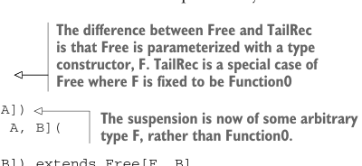

# Страница 0398

[← Страница 0397](./page-0397) | [Оглавление страниц](./) | [Страница 0399 →](./page-0399)

> Часть 4: Эффекты и I/O / Глава 13: Внешние эффекты и I/O / 13.4 Более нюансированный тип I/O

## 369 13.4 Более нюансированный тип I/O

```scala
case Suspend(resume: Par[A])
case FlatMap[A, B](sub: Async[A],
k: A => Async[B]) extends Async[B]
def flatMap[B](f: A => Async[B]): Async[B] =
FlatMap(this, f)
def map[B](f: A => B): Async[B] =
flatMap(a => Return(f(a)))
```

Заметьте, пацаны, аргумент ``resume`` в ``Suspend`` теперь чистый ``Par[A]``, а не этот ваш ``()`` ``=>`` ``A`` (или ``Function0[A]``, чтоб было совсем как в аду стека). Имплементация ``run`` под это дело перелопачена — теперь она выдаёт ``Par[A]`` вместо старого ``A``, и мы тащим отдельную хвостово-рекурсивную функцию ``step``, чтоб конструкторы ``FlatMap`` перетасовать, как карты в казино без переполнения стека.

```scala
@annotation.tailrec final def step: Async[A] = this match
case FlatMap(FlatMap(x, f), g) => x.flatMap(a => f(a).flatMap(g)).step
case FlatMap(Return(x), f) => f(x).step
case _ => this
def run: Par[A] = step match
case Return(a) => Par.unit(a)
case Suspend(r) => r
case FlatMap(x, f) => x match
case Suspend(r) => r.flatMap(a => f(a).run)
case _ => sys.error("Impossible, since `step` eliminates these cases")
```

Наш тип данных ``Async`` теперь жрёт асинхронку на завтрак — засовываем её через конструктор ``Suspend``, который хавает любой произвольный ``Par``, как универсальный пылесос. Работает, как часы, но мы, ФП-ветераны с 16-летним стажем в продакшен-ебле, не унимаемся: абстрагируем выбор типа-конструктора в ``Suspend`` на максимум. Обобщаем ``Async``, параметризуем его на какой-нибудь универсальный тип-конструктор ``F``, вместо того чтоб жёстко привязываться к ``Function0`` или ``Par``, как лохи в imperative-болоте. Назовём эту абстрактную прелесть ``Free``:



> Разница между Free и TailRec в том, что Free параметризован тип-конструктором F[_]. TailRec — это частный случай Free, где F прибит гвоздями к Function0, чтоб не разбежался.

```scala
enum Free[F[_], A]:
case Return(a: A)
case Suspend(s: F[A])
case FlatMap[F[_], A, B](
s: Free[F, A],
f: A => Free[F, B]) extends Free[F, B]
```

> Теперь suspension какого-то произвольного типа F, а не жесткого Function0 — полная свобода, блядь.

А ``TailRec`` и ``Async`` — это просто type aliases, чтоб не путаться в именах, как в старом добром Cats-Effect цирке:

```scala
type TailRec[A] = Free[Function0, A]
type Async[A] = Free[Par, A]
```

[← Страница 0397](./page-0397) | [Оглавление страниц](./) | [Страница 0399 →](./page-0399)
