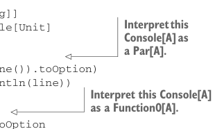

# Страница 0400
[<- Страница 0399](./page-0399) | [Индекс страниц](./) | [Страница 0401 ->](./page-0401)

> Часть 4: Эффекты и I/O / Глава 13: Внешние эффекты и I/O / 13.4 Более нюансированный тип I/O / 13.4.2 Монaда только под консольный I/O

## 371 13.4 Более нюансированный тип I/O

Что за хуйня такая `Free[F,` `A]`? Короче, это рекурсивная матрёшка: внутри значение типа `A`, обёрнутое в ноль или кучу слоёв `F`.11 Монaдой она потому и является, что `flatMap` позволяет выковырять `A` и накатить ещё обёрток `F`, как слои лука в шаурме. Интерпретатор, чтоб до начинки добраться, должен все эти `F` слои распотрошить. Смотри на структуру и интерпретатор как на два корутина, которые дерутся за управление потоком, а тип `F` — это правила ринга, протокол их танго. Подбираешь `F` с мозгами — и никаких сюрпризов, только разрешённые трюки.

### 13.4.2 Монaда только под консольный I/O

`Function0` — это не просто ленивый выбор для параметра типа `F`, а вообще один из самых распущенных: что угодно можно. Из-за этого нихуя не порассуждаешь, какую же херню натворит значение типа `Function0[A]`. Более жёсткий вариант для `F` в `Free[F,` `A]` — это ADT, который моделирует только общение с консолью, без прочей ерунды.

Listing 13.6 Создаём наш тип `Console`

```scala
enum Console[A]:
case ReadLine extends Console[Option[String]]
case PrintLine(line: String) extends Console[Unit]
```



> Вытаскиваем из этого Console[A] Par[A], как из коробки.

```scala
def toPar: Par[A] = this match
case ReadLine => Par.lazyUnit(Try(readLine()).toOption)
case PrintLine(line) => Par.lazyUnit(println(line))
```

> Вытаскиваем из этого Console[A] Function0[A], чтоб лениво выполнилось.

```scala
def toThunk: () => A = this match
case ReadLine => () => Try(readLine()).toOption
case PrintLine(line) => () => println(line)
```

`Console[A]` — это вычисление, которое в итоге сплюёт `A`, но только в двух формах: `ReadLine` (тип `Console[Option[String]]`) или `PrintLine`. Запекли в `Console` два интерпретатора: один переводит в `Par`, другой — в `Function0`. Имплементации — раз плюнуть, без подвохов. Теперь встраиваем эту хрень в `Free` — и вуаля, ограниченный `IO` чисто под консоль. Просто лепим через конструктор `Suspend` из `Free`:

```scala
object Console:
def readLn: Free[Console, Option[String]] =
Suspend(ReadLine)
def printLn(line: String): Free[Console, Unit] =
Suspend(PrintLine(line))
```

11Или по-другому: дерево, где листья — данные типа `A`, а ветвление задаёт `F`. Ещё вариант: AST для проги на языке с инструкциями из `F` и свободными переменными в `A`.

[<- Страница 0399](./page-0399) | [Индекс страниц](./) | [Страница 0401 ->](./page-0401)
