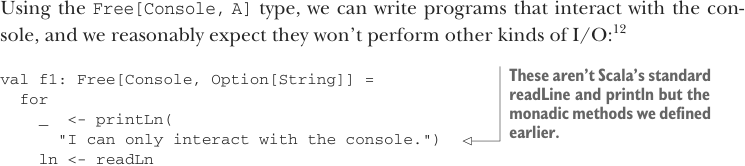
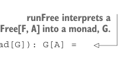

# Страница 0401
[<- Страница 0400](./page-0400) | [Индекс страниц](./) | [Страница 0402 ->](./page-0402)

> Часть 4: Эффекты и I/O / Глава 13: Внешние эффекты и I/O / 13.4 Более нюансированный тип I/O / 13.4.2 Монaда, которая поддерживает только консольный I/O

С типом `Free[Console, A]` мы можем слепить проги, которые только с консолью базачат, и вполне логично ожидать, что они не полезут хуем в другие виды I/O:12



> Это не стандартные readLine и println из Scala, а монадические методы, которые мы раньше сами наваяли.

```scala
val f1: Free[Console, Option[String]] =
for
_
<- printLn(
"I can only interact with the console.")
ln <- readLn
yield ln
```

Звучит заебись, но как на хуй запустить этот `Free[Console, A]` по-настоящему? Вспомним сигнатуру нашего `run`:

```scala
def run(using F: Monad[F]): F[A]
```

Чтобы крутануть `Free[Console, A]`, нам вроде как нужен `Monad[Console]`, а его-то как раз и нету. Невозможно реализовать `flatMap` для `Console`:

```scala
enum Console[A]:
def flatMap[B](f: A => Console[B]): Console[B] = this match
case ReadLine => ???
case PrintLine(s) => ???
```

В кейсе `ReadLine` нам нужна ценность типа `Option[String]`, чтоб скормить её в `f`, но откуда её взять? Результат чтения строки материализуется только когда `ReadLine` интерпретируется. Короче, надо как-то оттянуть этот `flatMap` до интерпретатора. Мы должны перевести наш тип `Console`, который монадой не является (как импотент в FP-мире), в какой-нибудь другой тип (типа `Function0` или `Par`), который монадой является. Можем обобщить определение `run`, чтоб оно ловило эту трансформацию в целевую монаду:



> runFree интерпретирует Free[F, A] в монаду G.

```scala
enum Free[F[_], A]:
...
def runFree[G[_]](t: [x] => F[x] => G[x])(using G: Monad[G]): G[A] =
step match
case Return(a) => G.unit(a)
case Suspend(r) => t(r)
case FlatMap(Suspend(r), f) => t(r).flatMap(a => f(a).runFree(t))
case FlatMap(_, _) =>
sys.error("Impossible, `step` eliminates these cases")
```

`runFree` юзает предоставленную трансформацию `t`, чтоб конвертить каждый `F[x]` в `G[x]` по ходу интерпретации проги `Free[F, A]`. Параметр `t` использует синтаксис, которого мы раньше не видели — это *полиморфный тип функции*, функция, которая жрёт типовые параметры. `t` — это функция от `F[x]` к `G[x]` для любого `x`. Поэтому `t` может превратить `F[Unit]` в `G[Unit]` или `F[Int]` в `G[Int]`, но не `F[Int]` в `G[Boolean]`. Тип `t` — `[x] => F[x] => G[x]` — требует, чтоб тип, применённый к `G`, совпадал с типом, применённым к `F`.

12Конечно, Scala-прога всегда технически может накосячить сайд-эффектами — это как алкаш на код-ревью, который "ну я же почти трезвый". Но мы тут предполагаем, что ты, пацан, принял дисциплину FP без сайдов, потому что Scala тебя за ручку не поведёт и не гарантирует.

[<- Страница 0400](./page-0400) | [Индекс страниц](./) | [Страница 0402 ->](./page-0402)
