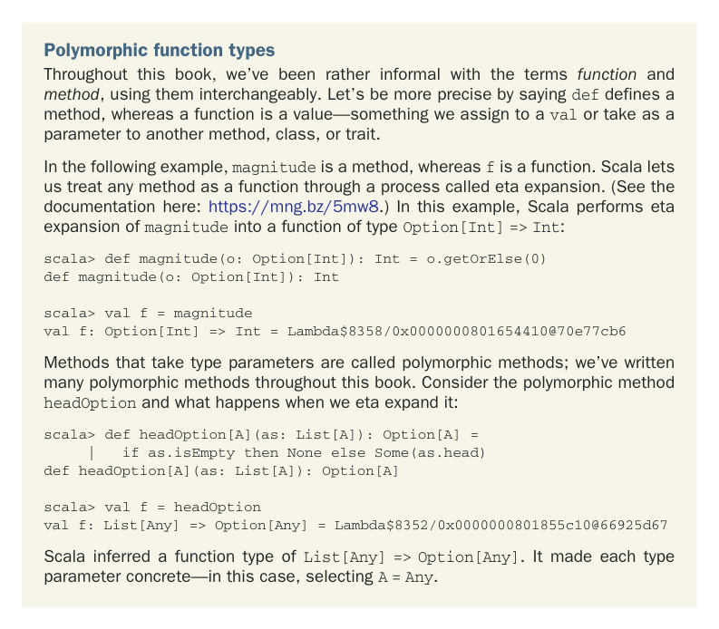

# Страница 0402

[<- Страница 0401](./page-0401) | [Индекс страниц](./) | [Страница 0403 ->](./page-0403)

> Часть 4: Эффекты и I/O / Глава 13: Внешние эффекты и I/O / 13.4 Более нюансированный тип I/O / 13.4.2 Монaда только для консольного I/O

## 373 13.4 Более нюансированный тип I/O

Зачем нам тут полиморфная функция, бля? Почему бы не засунуть простой `F[A]` `=>` `G[A]`? Или, может, подкрутить сигнатуру `runFree` под `def` `runFree[G[_],` `B](t:` `F[B]` `=>` `G[B])(using` `G:` `Monad[G]):` `G[A]`? Когда интерпретируем `Free[F,` `A]`, натыкаемся на всякие free-программы разного калибра — как в зоопарке на код-ревью, где каждый второй тип свой. Возьмём free-программу, которая сосёт инт из консоли:

```scala
def readInt: Free[Console, Option[Int]] =
for
ln <- readLn
yield ln.toIntOption
```

Программа `readInt` имеет структуру `FlatMap(Suspend(ReadLine),` `ln` `=>` `Return(ln.toIntOption))`. При разборе этой хуйни мы упираемся в `Free[Console,` `String]`, несмотря на то что вся конструкция — `Free[Console,` `Option[Int]]`. Функция, которую пихаем в `FlatMap`, конвертит `String` в `Option[Int]`, но интерпретатору, сука, нужно уметь обрабатывать `F[x]` в `G[x]` для любого `x`, который подвернётся. Поэтому любая монолитная функция типа `F[A]` `=>` `G[A]` — полное говно, не взлетит.



Полиморфные типы функций. Всю книгу мы лениво путали *функцию* и *метод*, как будто это синонимы в пивнухе после дедлайна. Давайте по-взрослому: `def` определяет метод, а функция — это value, которое лепим в `val` или суём в параметры другого метода, класса или трейта. Как конструктор в Lego, который можно переиспользовать.

В примере ниже `magnitude` — метод, а `f` — функция. Скала позволяет обращаться с методом как с функцией через eta-экспансию — это как апгрейд из mutable в immutable, магия. (Смотрите доки тут: https://mng.bz/5mw8.) В этом примере Скала делает eta-экспансию `magnitude` в функцию типа `Option[Int]` `=>` `Int`:

```scala
scala> def magnitude(o: Option[Int]): Int = o.getOrElse(0)
def magnitude(o: Option[Int]): Int
scala> val f = magnitude
val f: Option[Int] => Int = Lambda$8358/0x0000000801654410@70e77cb6
```

Методы с type-параметрами зовутся полиморфными методами — мы их дохуя накатали в книге, помните те map и flatMap? Взгляньте на полиморфный метод `headOption` и что творится при eta-экспансии:

```scala
scala> def headOption[A](as: List[A]): Option[A] =
|
if as.isEmpty then None else Some(as.head)
def headOption[A](as: List[A]): Option[A]
scala> val f = headOption
val f: List[Any] => Option[Any] = Lambda$8352/0x0000000801855c10@66925d67
```

Скала вывела тип функции `List[Any]` `=>` `Option[Any]`. Она законкретила каждый type-параметр — тут выбрала `A` `=` `Any`, как компилятор на стероидах, который сам угадывает, что тебе надо.

[<- Страница 0401](./page-0401) | [Индекс страниц](./) | [Страница 0403 ->](./page-0403)
