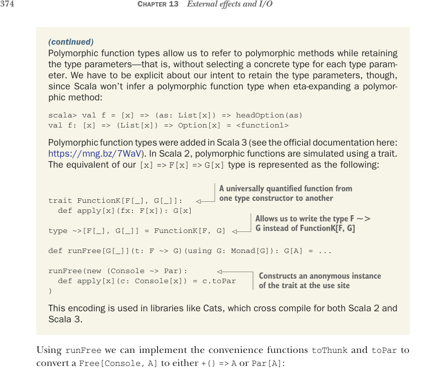

# Страница 0403
[<- Страница 0402](./page-0402) | [Индекс страниц](./) | [Страница 0404 ->](./page-0404)

> Часть 4: Эффекты и I/O / Глава 13: Внешние эффекты и I/O / 13.4 Более нюансированный тип I/O / 13.4.2 Монада только под консольный I/O



### (продолжение) Полиморфные типы функций — это как cheat code для полиморфных методов: ссылаемся на них, не теряя параметры типов, без этой хуйни с выбором конкретики для каждого. Но Scala, сука, не телепат — не выведет полиморфный тип функции при eta-расширении, приходится пинать явно:

```scala
scala> val f = [x] => (as: List[x]) => headOption(as)
val f: [x] => (List[x]) => Option[x] = <function1>
```

Полиморфные типы функций ввалились в Scala 3 (доки официальные тут: https://mng.bz/7WaV). В Scala 2 это симуляция через трейт, чтоб не сдохнуть от зависти. Наш тип `[x]` `=>` `F[x]` `=>` `G[x]` выглядит так:

> Универсально-квантифицированная функция от одного конструктора типов к другому — типа, "от F к G, без бабла"

```scala
trait FunctionK[F[_], G[_]]:
def apply[x](fx: F[x]): G[x]
```

> Теперь можно лепить F ~> G вместо этой громоздкой FunctionK[F, G] — как стрелочка в диаграмме, короче

```scala
type ~>[F[_], G[_]] = FunctionK[F, G]
def runFree[G[_]](t: F ~> G)(using G: Monad[G]): G[A] = ...
runFree(new (Console ~> Par):
def apply[x](c: Console[x]) = c.toPar
)
```

> Строит анонимный инстанс трейта прямо на месте — никаких лишних классов, чистый хак

Такая кодировка в Cats, которые, как всегда, впереди планеты всей — кросс-компилятся под Scala 2 и 3, чтоб мы не ныли на миграциях.

С `runFree` лепим удобняк `toThunk` и `toPar` — конвертим `Free[Console,` `A]` в `+()` `=>` `A` или в `Par[A]`, без лишней жести:

```scala
extension [A](fa: Free[Console, A])
def toThunk: () => A =
fa.runFree([x] => (c: Console[x]) => c.toThunk)
def toPar: Par[A] =
fa.runFree([x] => (c: Console[x]) => c.toPar)
```

Это жрёт инстансы `Monad[Function0]` и `Monad[Par]` — без них нихуя не взлетит:

```scala
given function0Monad: Monad[Function0] with
def unit[A](a: => A) = () => a
extension [A](fa: Function0[A])
def flatMap[B](f: A => Function0[B]) =
() => f(fa())()
given parMonad: Monad[Par] with
def unit[A](a: => A) = Par.unit(a)
```

[<- Страница 0402](./page-0402) | [Индекс страниц](./) | [Страница 0404 ->](./page-0404)
