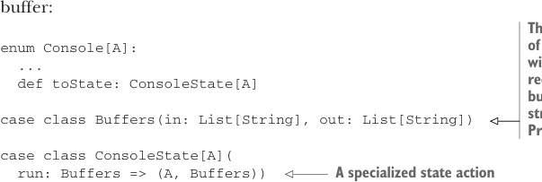
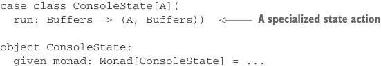

# Страница 0405

[<- Страница 0404](./page-0404) | [Указатель страниц](./) | [Страница 0406 ->](./page-0406)

> Часть 4: Эффекты и ввод-вывод / Глава 13: Внешние эффекты и I/O / 13.4 Более нюансированный тип I/O / 13.4.3 Чистые интерпретаторы

```scala
object ConsoleReader:
given monad: Monad[ConsoleReader] with
def unit[A](a: => A) = ConsoleReader(_ => a)
extension [A](fa: ConsoleReader[A])
def flatMap[B](f: A => ConsoleReader[B]) = fa.flatMap(f)
```

Добавляем ещё одну функцию на `Console` и `toReader`, а потом на её основе лепим `toReader` для `Free[Console,` `A]` — как конструктор Lego, только без соплей от перегрузки:

```scala
enum Console[A]:
...
def toReader: ConsoleReader[A]
extension [A](fa: Free[Console, A])
def toReader: ConsoleReader[A] =
fa.runFree([x] => (c: Console[x]) => c.toReader)
```

А для полной симуляции консольного I/O можно слепить интерпретатор с двумя списками — один как буфер ввода (типа очередь в Макдаке, откуда тянешь заказы), другой для вывода (куда сливаешь логи). Наткнётся на `ReadLine` — выдернет строку из инпута, а на `PrintLine(s)` — запушит `s` в аутпут. Идеально для тестов, где не хочешь ебаться с реальной консолью, как в том меме про "works on my machine".



> Это пара буферов. Буфер ввода кормится запросами ReadLine, а выходной ловит строки из PrintLine-запросов.

```scala
enum Console[A]:
...
def toState: ConsoleState[A]
case class Buffers(in: List[String], out: List[String])
case class ConsoleState[A](
run: Buffers => (A, Buffers))
```



> Специализированный state action

```scala
object ConsoleState:
given monad: Monad[ConsoleState] = ...
```


```scala
extension [A](fa: Free[Console, A])
def toState: ConsoleState[A] =
```

> Превращает в чистый state action

```scala
fa.runFree([x] => (c: Console[x]) => c.toState)
```

Теперь у нас куча интерпретаторов для этих мини-языков! Например, `toState` юзаем для тестов консольных аппов с нашей property-based либой из 8-й главы (где генерим хаос и проверяем, не сломалось ли), а `unsafeRunConsole` — чтоб реально прогнать прогу в проде.^13

То, что мы слепили generic `runFree`, который превращает `Free`-проги в `State` или `Reader`-значения, — это просто пиздец как круто показывает: в типе `Free` нихуя нет такого, что заставляет городить сайд-эффекты. Например, с точки зрения нашей

13 Обратите внимание, `toReader` и `toState` не stack-safe по тем же причинам, по которым `toThunk` не был stack-safe — классический стек-оверфлоу от рекурсии, блядь. Фиксим, меняя репрезентации на `String => TailRec[A]` для `ConsoleReader` и `Buffers => TailRec[(A, Buffers)]` для `ConsoleState`.

[<- Страница 0404](./page-0404) | [Указатель страниц](./) | [Страница 0406 ->](./page-0406)
