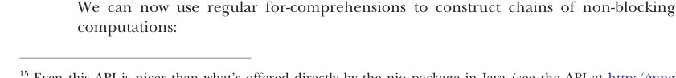

# Страница 0407
[<- Страница 0406](./page-0406) | [Индекс страниц](./) | [Страница 0408 ->](./page-0408)

> Часть 4: Эффекты и I/O / Глава 13: Внешние эффекты и I/O / 13.5 Неблокирующий и асинхронный I/O

Хотя этот простой пример вертится в ``Par``, который вроде как асинхронку в принципе пропускает, но мы ею нихуя не пользуемся — ``readLine`` и ``println`` это чисто блокирующие I/O-операции, как слоны в посудной лавке на код-ревью. 

Но есть I/O-библиотеки, которые неблокирующий I/O (non-blocking I/O) жрут нативно, и ``Par`` позволит нам к таким прилепиться. Детали этих либ пляшут от случая к случаю, но чтоб врубиться в суть, неблокирующий источник байт может иметь интерфейс типа вот такого:

```scala
trait Source:
  def readBytes(
    numBytes: Int,
    callback: Either[Throwable, Array[Byte]] => Unit
  ): Unit
```

Тут предполагается, что ``readBytes`` сваливает сразу, без тормозов. Мы пихаем в ``readBytes`` колбэк, который скажет, че делать, когда результат подоспеет или I/O-подсистема в жопу укусит ошибкой. Прям с такой lib'ой ковыряться — как гвозди зубами забивать.<sup>15</sup> 

Нам надо программировать против нормального композиционного монадического интерфейса и абстрагировать всю эту подкапотную херню с неблокирующим I/O. К счастью, тип ``Par`` позволяет эти колбэки обернуть по-умному:

```scala
opaque type Future[+A] = (A => Unit) => Unit
opaque type Par[+A] = ExecutorService => Future[A]
```

Реализация ``Future`` до жути смахивает на ``Source`` — это функция, которая ретируется мгновенно, но жрёт колбэк или continuation, чтоб его дернуть, как только значение типа ``A`` материализуется. Адаптировать ``Source.readBytes`` под ``Future`` — раз плюнуть, но в алгебру ``Par`` придётся впихнуть примитив:<sup>16</sup>

```scala
def async[A](f: (A => Unit) => Unit): Par[A] =
  es => cb => f(cb)
```

С этим на борту мы уже можем асинхронную ``readBytes`` завернуть в уютный монадический интерфейс ``Par``, чтоб цепочки неблокирующих вычислений строить как в FP-утопии:

```scala
def nonblockingRead(source: Source, numBytes: Int):
  Par[Either[Throwable, Array[Byte]]] =
  async: (cb: Either[Throwable, Array[Byte]] => Unit) =>
    source.readBytes(numBytes, cb)
def readPar(source: Source, numBytes: Int):
  Free[Par, Either[Throwable, Array[Byte]]] =
    Suspend(nonblockingRead(source, numBytes))
```



<sup>15</sup> Даже этот API слаще, чем сырой NIO-пакет (New I/O) в Java (зацените API по [ссылке](http://mng.bz/uojM)), который неблокирующий I/O якобы поддерживает. 

<sup>16</sup> Это, кстати, может быть самым базовым действием ``Par`` — как корень дерева, на котором остальные примитивы для ``Par`` из главы 7 висят, и я сам через это дерьмо в продакшене прогонял.

[<- Страница 0406](./page-0406) | [Индекс страниц](./) | [Страница 0408 ->](./page-0408)
