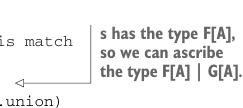

# Страница 0409
[<- Страница 0408](./page-0408) | [Индекс страниц](./) | [Страница 0410 ->](./page-0410)

> Часть 4: Эффекты и I/O / Глава 13: Внешние эффекты и I/O / 13.5 Неблокирующий и асинхронный I/O / 13.5.1 Композиция свободных алгебр

консоль или ещё какую-нибудь херню с эффектами. Выразительная сила у него — как у велосипедного насоса: только и может, что секвенсить операции из `Files`. 

Но с этим подходом мы методично превращаем любой набор I/O-операций в ADT (abstract data type), а потом `Free` лепит из них программы — цепочки этих примитивных опов, как конструктор Lego для FP-маньяков. 

Давай попробуем набросать утилиту `cat`, чтоб строки из файла слопать и в консоль выплюнуть:

```scala
def cat(file: String) =
  Files.readLines(file).flatMap: lines =>
    Console.printLn(lines.mkString("\n"))
```

Бля, не компилится, конечно! Скала орёт ошибку примерно такую:

```scala
-- [E007] Type Mismatch Error: ------------------------------------------
|
Console.printLn(lines.mkString("\n"))
|
^^^^^^^^^^^^^^^^^^^^^^^^^^^^^^^^^^^^^
|
Found:
 Free[Console, Unit]
|
Required: Free[Files, B]
|
|
where:
 B is a type variable with constraint
```

Что за херня тут творится? `Files.readLines(file)` кидает `Free[Files, List[String]]`. Мы это в `flatMap` заворачиваем и пытаемся выдать как `Free[Console, Unit]`. А Скала такая: «Эй, `Free[Console, Unit]` с `Free[Files, B]` для рандомного `B` не унифицируется, дебил!». 

Короче, `Files` и `Console` — разные алгебры, как масло и вода, нельзя их просто в один котёл и мешать, как в дешёвом рагу.

Давай подумаем, какой тип мы хотим, чтоб Скала вывел для `cat`. Нам программа нужна, которая юзает операции то из `Console`, то из `Files` — универсальный комбайн. Scala 3 с union types (union types) как раз для этого: лепим конструктор типа, который представляет union операций из `Console` и `Files` — то есть `[x] => Console[x] | Files[x]`. Тогда тип возврата `cat` превращается в `Free[[x] => Console[x] | Files[x], Unit]`. Теперь тип ясен, как день — как имплементим эту хуйню? 

Добавим метод в `Free`, чтоб конвертить `Free[F, A]` в `Free[[x] => F[x] | G[x], A]` для любого `G[_]`:

```scala
enum Free[F[_], A]:
  ...
  def union[G[_]]: Free[[x] =>> F[x] | G[x], A] = this match
    case Return(a) => Return(a)
    case Suspend(s) => Suspend(s: F[A] | G[A])
    case FlatMap(s, f) => FlatMap(s.union, a => f(a).union)
```



> у s тип F[A], так что мы можем явно приписать тип F[A] | G[A].


> Это распространяет union через оба аргумента FlatMap.

17 К сожалению, Scala 2 без union types — сплошной пиздец, композиция алгебр выходит костыльной, как самокат из подручных средств. Популярный хак — представлять составную алгебру как *копродукт* (coproduct) отдельных. Но это обычно тонна бойлерплейта на конверсии между индивидуальными алгебрами и копродуктом — я сам через это говно прошёл, аж тошнит.

[<- Страница 0408](./page-0408) | [Индекс страниц](./) | [Страница 0410 ->](./page-0410)
