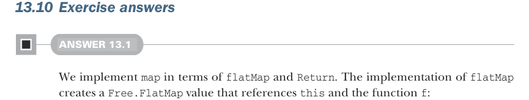

# Страница 0419

[<- Страница 0418](./page-0418) | [Индекс страниц](./) | [Страница 0420 ->](./page-0420)

> Часть 4: Эффекты и I/O / Глава 13: Внешние эффекты и I/O / 13.10 Ответы на упражнения



### 13.10 Ответы на упражнения

#### РАЗБОР 13.1

Мы лепим `map` на базе `flatMap` и `Return` — классика, когда хочешь не изобретать велосипед, а прикрутить готовые колёса. А в имплементации `flatMap` рождается значение `Free.FlatMap`, которое держит за хвост `this` и функцию-замыкание `f`:

```scala
enum Free[F[_], A]:
case Return(a: A)
case Suspend(s: F[A])
case FlatMap[F[_], A, B](
s: Free[F, A],
f: A => Free[F, B]) extends Free[F, B]
def flatMap[B](f: A => Free[F, B]): Free[F, B] =
FlatMap(this, f)
def map[B](f: A => B): Free[F, B] =
flatMap(a => Return(f(a)))
object Free:
given freeMonad[F[_]]: Monad[[x] =>> Free[F, x]] with
def unit[A](a: => A) = Return(a)
extension [A](fa: Free[F, A])
def flatMap[B](f: A => Free[F, B]) = fa.flatMap(f)
```


#### РАЗБОР 13.2

Мы паттерн-матчим на стартовом `Free[Function0, A]` — как в старом добром дизассемблере, разбираем по косточкам. Наткнулись на `FlatMap`? Ныряем глубже, матчим внутренний `Free[Function0, X]`. Если внутри чистый `Return`, то кидаем в оригинальную континуацию `f` эту возвращёнку и запускаем результат — бац, и готово. Если `Suspend`, то форсим thunk (thunk, ленивую функцию) — ну, заставляем его проснуться, лентяя — и так же пуляем в оригинальную `f` плод его лени. А если ещё один `FlatMap` — вот тут подвох, переассоциируем `flatMap`-ы вправо, чтоб не стекло в `OverflowError`, как в том меме про бесконечный рекурсивный вызов: превращаем `FlatMap(FlatMap(fy, g), f)` в `FlatMap(fy, y => FlatMap(g(y), f))` — и жмём на газ, запускаем:

```scala
extension [A](fa: Free[Function0, A])
@annotation.tailrec
def runTrampoline: A = fa match
case Return(a) => a
case Suspend(ta) => ta()
case FlatMap(fx, f) => fx match
case Return(x) => f(x).runTrampoline
case Suspend(tx) => f(tx()).runTrampoline
case FlatMap(fy, g) => fy.flatMap(y => g(y).flatMap(f)).runTrampoline
```

[<- Страница 0418](./page-0418) | [Индекс страниц](./) | [Страница 0420 ->](./page-0420)
