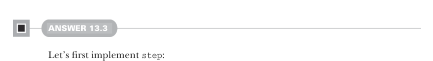

# Страница 0420
[<- Страница 0419](./page-0419) | [Индекс страниц](./) | [Страница 0421 ->](./page-0421)

> Часть 4: Эффекты и I/O / Глава 13: Внешние эффекты и I/O / 13.10 Ответы на упражнения



#### ОТВЕТ 13.3

Сначала замутим `step`, без него никуда:

```scala
@annotation.tailrec
final def step: Free[F, A] = this match
  case FlatMap(FlatMap(fx, f), g) => fx.flatMap(x => f(x).flatMap(g)).step
  case FlatMap(Return(x), f) => f(x).step
  case _ => this
```

Главная задача `step` — перелопатить вход в одну из трёх поз, как в старом добром парсере, 
который не хочет тонуть в левом рекурсе:

- `Return`
- `Suspend`
- Правый ассоциативный `FlatMap(Suspend(fx), f)`

Реализуем через паттерн-матчинг на входе. Натыкаемся на левый ассоциативный `FlatMap` — 
переставляем в правый, степаем результат и катим дальше. Вылез `FlatMap(Return(x), f)` — 
упрощаем до посинения и возвращаем. В остальном — сливаем вход как есть, это же чистый 
`Return`, `Suspend` или `FlatMap(Suspend(fx), f)`, без подвохов.

Эта херня с `step` делает `run` проще параши — степаем вход, патчим результат и разворачиваем 
три кейса, что `step` выдал. Скала, бедняга, не в курсе, что `step` уже выжег всякую дрянь 
вроде `FlatMap(Return(a), f)` или `FlatMap(FlatMap(fy, g), f)`, так что пихаем вайлдкард 
с рантайм-крашем — чтоб компилятор отъебался от exhaustiveness checker'а 
(проверщика исчерпываемости), классический трюк из арсенала FP-ветерана:

```scala
def run(using F: Monad[F]): F[A] = step match
  case Return(a) => F.unit(a)
  case Suspend(fa) => fa
  case FlatMap(Suspend(fa), f) => fa.flatMap(a => f(a).run)
  case FlatMap(_, _) =>
    sys.error("Impossible, `step` eliminates these cases")
```


#### ОТВЕТ 13.4

`runFree` позволяет слить `Free[F, A]` в `G[A]` для какого-нибудь тип-конструктора `G`, 
а `translate` — `Free[F, A]` в `Free[G, A]` для такого же `G`. Перефразируем `runFree`, 
переименовав `G` в `H` — `runFree` тащит `Free[F, A]` в `H[A]` для `H`. Замутим `translate` 
через `runFree`: берём `H[x] = Free[G, x]`. Теперь нужен полиморфный маппер, который из 
`F[x]` слепит `Free[G, x]` — и это мы хапаем, suspend'нув перевод `F[x]` в `G[x]`, 
как ленивый мем с котом, который откладывает всё на потом:

```scala
def translate[G[_]](fToG: [x] => F[x] => G[x]): Free[G, A] =
  runFree([x] => (fx: F[x]) => Suspend(fToG(fx)))
```

[<- Страница 0419](./page-0419) | [Индекс страниц](./) | [Страница 0421 ->](./page-0421)
