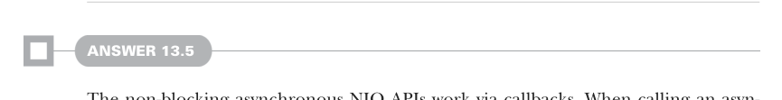

# Страница 0421
[<- Страница 0420](./page-0420) | [Индекс страниц](./) | [Страница 0422 ->](./page-0422)

> Часть 4: Эффекты и I/O / Глава 13: Внешние эффекты и I/O / 13.10 Ответы на упражнения

Короче, реализуем `unsafeRunConsole`, просто превращая каждый `Console[x]` в ленивый thunk типа `x` — типа, оборачиваем в `() =>`,
чтоб не дёргался раньше времени. Получается `Free[Function0, A]`, а потом пускаем этот внутренний `Free[Function0, A]` в полёт через
`runTrampoline` — и вуаля, как по маслу:

```scala
extension [A](fa: Free[Console, A])
  def unsafeRunConsole: A =
    fa.translate([x] => (c: Console[x]) => c.toThunk).runTrampoline
```



#### Ответ 13.5

Неблокирующие асинхронные NIO API (New I/O) — это классика на колбэках (callbacks), помните те джавовские мучения? Вызываешь асинхронный
NIO API, суёшь ему колбэк при запросе I/O-операции, и NIO дёргает его, как только операция допилится до конца. Конструктор `Par.async`
как раз и позволяет перековать эти API на колбэках (callback-based API) в нормальные `Par`-значения — без слёз и истерик. Чтобы замутить
`read`, зовём `Par.async` и пихаем функцию, которая ловит колбэк. Эта функция делает I/O-запрос к `AsynchronousFileChannel`, а в комплекте
с запросом передаёт обработчик завершения (completion handler), который дёргает колбэк, что нам подкинул `Par.async`. Подключив handler
к колбэку — бам, `Par`-значение от `Par.async` завершится аккуратненько, когда handler сработает, без всяких состояний гонки (race conditions)
и прочей хуйни:

```scala
def read(
  file: AsynchronousFileChannel,
  fromPosition: Long,
  numBytes: Int
): Free[Par, Either[Throwable, Array[Byte]]] =
  Suspend(
    Par.async: (cb: Either[Throwable, Array[Byte]] => Unit) =>
      val buf = ByteBuffer.allocate(numBytes)
      file.read(
        buf,
        fromPosition,
        (),
        new CompletionHandler[Integer, Unit]:
          def completed(bytesRead: Integer, ignore: Unit) =
            val arr = new Array[Byte](bytesRead)
            buf.slice.get(arr, 0, bytesRead)
            cb(Right(arr))
          def failed(err: Throwable, ignore: Unit) =
            cb(Left(err))
      )
  )
```


#### Ответ 13.6

Как и в `flatMap`, метод `run` юзает `F` в контравариантной позиции — ну вы поняли, классический подвох с типами, где компилятор ебёт мозги.
Поэтому механически вводим тип-параметр, который супертипит `F`, и вперёд:

```scala
def run[F2[x] >: F[x]](using F: Monad[F2]): F2[A] = step match
  case Return(a) => F.unit(a)
  case Suspend(fa) => fa
```

[<- Страница 0420](./page-0420) | [Индекс страниц](./) | [Страница 0422 ->](./page-0422)
