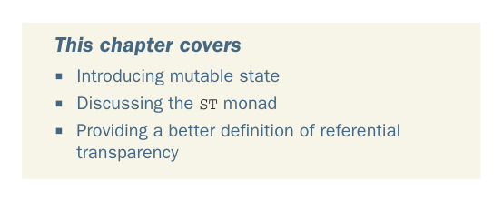

# Страница 0423
[<- Страница 0422](./page-0422) | [Индекс страниц](./) | [Страница 0424 ->](./page-0424)

> Часть 4: Эффекты и I/O / Глава 14: Локальные эффекты и мутабельное состояние

## Локальные эффекты и мутабельное состояние

### В этой главе мы разберём

- Знакомство с мутабельным состоянием
- Разбор монады `ST`
- Более точное определение референциальной прозрачности

Помните первую главу этой книги? Там мы закинули референциальную прозрачность как фундамент чисто функционального программирования — типа, чистые функции святоши, не мутируют данные на месте и не лезут в внешний мир, как в меме про кота, который не трогает лазерную указку. В 13-й главе выяснилось, что это не совсем так, блядь; можно пилить чисто функциональные и композиционные проги, которые описывают взаимодействия с внешним миром, но сами по себе — кристально чистые. Эти ребята даже не в курсе, что их интерпретатор может быть с побочками и мир перелопатить. Здесь мы апгрейдим это понятие до adult-версии (взрослой версии): эффекты могут тусоваться локально внутри экспрешена, и мы гарантируем, что остальной код большой программы — нихуя не заметит, как слон в посудной лавке мимо пройдёт. Плюс, введём идею, что экспрешены референциально прозрачны относительно одних программ (типа, chill — по кайфу), а относительно других — полный пиздец и сюрприз.

**394**

[<- Страница 0422](./page-0422) | [Индекс страниц](./) | [Страница 0424 ->](./page-0424)
