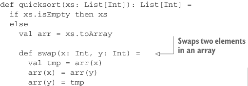

# Страница 0424
[<- Страница 0423](./page-0423) | [Индекс страниц](./) | [Страница 0425 ->](./page-0425)

> Часть 4: Эффекты и ввод-вывод / Глава 14: Локальные эффекты и мутабельный стейт / 14.1 Чисто функциональный мутабельный стейт

## 395. 14.1 Чисто функциональный мутабельный стейт

### 14.1 Чисто функциональный мутабельный стейт

Братья, до этого момента вы, поди, думали, что в чистом FP мутабельный стейт — это как сигареты в офисе после запрета: нельзя, и точка. А хуй там плавал! Если вчитаться в дефы референциальной прозрачности и чистоты, то мутация локального стейта ни хуя не запрещена. Давайте-ка вернёмся к нашим определениям из первой главы, чтоб не было иллюзий.


**Определения референциальной прозрачности и чистоты**

*Референциальная прозрачность (referential transparency)* — Выражение `e` референциально прозрачно, если для всех программ `p` все вхождения `e` в `p` можно заменить результатом вычисления `e` без изменения смысла `p`.

*Чистота (purity)* — Функция `f` чиста, если выражение `f(x)` референциально прозрачно для всех референциально прозрачных `x`.

По этим дефам, функция ниже — чистая как слеза девственницы, хоть и юзает `while`-петлю, обновляемый `var` и мутабельный массив. Это как quicksort на стероидах в твоём локальном подвале — снаружи чисто, внутри ебля полная.

**Листинг 14.1.** `quicksort` на месте (in-place) с мутабельным массивом

```scala
def quicksort(xs: List[Int]): List[Int] =
  if xs.isEmpty then xs
  else
    val arr = xs.toArray
```



> Меняет местами два элемента в массиве


```scala
def swap(x: Int, y: Int) =
  val tmp = arr(x)
  arr(x) = arr(y)
  arr(y) = tmp
```

> Разделяет часть массива на элементы меньше и больше опорного соответственно

```scala
def partition(n: Int, r: Int, pivot: Int) =
  val pivotVal = arr(pivot)
  swap(pivot, r)
  var j = n
  for i <- n until r if arr(i) < pivotVal do
    swap(i, j)
    j += 1
  swap(j, r)
  j
```

> Сортирует часть массива на месте

```scala
def qs(n: Int, r: Int): Unit =
  if n < r then
    val pi = partition(n, r, n + (n - r) / 2)
    qs(n, pi - 1)
    qs(pi + 1, r)
  qs(0, arr.length - 1)
  arr.toList
```

[<- Страница 0423](./page-0423) | [Индекс страниц](./) | [Страница 0425 ->](./page-0425)
