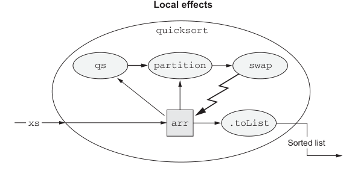

# Страница 0425
[<- Страница 0424](./page-0424) | [Индекс страниц](./) | [Страница 0426 ->](./page-0426)

> Часть 4: Эффекты и I/O / Глава 14: Локальные эффекты и мутабельное состояние / 14.2 Тип данных для принуждения области видимости побочных эффектов

Функция `quicksort` сортирует список, превращая его в мутабельный массив, сортируя этот массив на месте с помощью легендарного quicksort'а — того самого, что всех наебал своей "эффективностью" в теории, — а потом обратно в список. Ни один звоночек снаружи не просечёт, что подвыражения внутри тела `quicksort` не референциально прозрачны, или что локальные методы `swap`, `partition` и `qs` не чистые на 100%, потому что нигде вне `quicksort` никто не держит ссылку на этот мутабельный кусок дерьма. Всё мутирование локально, как запой в гараже, — снаружи чисто, функция в целом чистая. То есть, для любой референциально прозрачной экспрессии `xs` типа `List[Int]` выражение `quicksort(xs)` тоже референциально прозрачно, без подвохов.



**Локальные эффекты**

```scala
quicksort
partition
swap
qs
xs
.toList
arr
```

Отсортированный список

> Мутация внутри функции — не побочный эффект, если снаружи никто не ссылается на мутированный объект.

Рисунок 14.1 Локальные эффекты

Некоторые алгоритмы, типа `quicksort`, просто не взлетят без мутации на месте — либо насрутся логикой, либо затормозят, как legacy-монстр на Java 6. К счастью, локально сварганенные данные мы можем ебать без риска, как свой собственный тестовый стенд. Любая функция может внутри творить побочный пиздец с мутабельщиной, но снаружи светить чистым интерфейсом, и нам нехуй стесняться этим пользоваться в продакшене. Мы можем фанатеть от чисто функциональных компонентов по другим причинам — они проще в отладке, как Lego собираются из других чистых фич, легче тестовить без моков, — но в принципе строить чистую функцию на локальных побочках — это не грех, а хитрый трюк, через который все мы проходили, когда deadline жмёт.

### 14.2 Тип данных для принуждения области видимости побочных эффектов

Предыдущий раздел чётко даёт понять: чистые функции могут иметь побочки, но только по отношению к локальным данным, как в песочнице. `quicksort` может мутить массив, потому что сама его выделила, он локальный, и снаружи эту хуйню не видно — ни один observer не пикнет. А вот если бы `quicksort` напрямую мутила входной список (как в тех мутабельных коллекциях из ада, где все через это страдали), то побочка была бы видна всем звоночкам `quicksort`, и привет, нечистота на уровне.

[<- Страница 0424](./page-0424) | [Индекс страниц](./) | [Страница 0426 ->](./page-0426)
