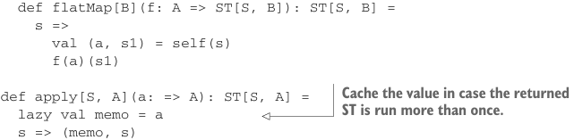

# Страница 0427

[<- Страница 0426](./page-0426) | [Индекс страниц](./) | [Страница 0428 ->](./page-0428)

> Часть 4: Эффекты и I/O / Глава 14: Локальные эффекты и мутабельное состояние / 14.2 Тип данных для принуждения области видимости побочных эффектов / 14.2.2 Алгебра мутабельных ссылок


### Но это всё ещё не панацея от бед

Вызывающий код может припрятать эту (якобы) неизменяемую последовательность `Seq[Byte]`, а когда мы на следующем чтении перезапишем базовый массив, этот хитрец увидит, как данные у него под носом меняются, будто в цирке с конями!

Чтобы переиспользуемые буферы не подставляли нас под удар, надо жёстко ограничить область жизни вида `Seq[Byte]`, который мы кидаем вызывающим, и проследить, чтоб они не цеплялись за эти мутабельные буферы ни напрямую, ни через заднюю дверь, когда стартует следующее чтение и затирает `Array[Byte]` в хлам.

Загляните в заметки к главе 15 ([https://github.com/fpinscala/fpinscala/wiki](https://github.com/fpinscala/fpinscala/wiki)) — там ещё покопаемся в таких кейсах, где мутация норовит вырваться.

Мы окрестим этот свежий монад локальных эффектов `ST` — расшифровывается как *state thread* (поток состояния), *state transition* (переход состояния), *state token* (токен состояния) или *state tag* (тег состояния), выбирайте на вкус. Отличается он от `State` тем, что прямой доступ к базовой функции отрезан наглухо, как яйца у кота перед стрижкой, но структура — один в один, без подвохов.

**Листинг 14.2. Наш новый тип данных `ST`**

```scala
opaque type ST[S, A] = S => (A, S)
object ST:
extension [S, A](self: ST[S, A])
def map[B](f: A => B): ST[S, B] =
s =>
val (a, s1) = self(s)
(f(a), s1)
```



```scala
def flatMap[B](f: A => ST[S, B]): ST[S, B] =
s =>
val (a, s1) = self(s)
f(a)(s1)
```

> Кэшируем значение на случай, если возвращаемый ST запустят не раз.

```scala
def apply[S, A](a: => A): ST[S, A] =
lazy val memo = a
s => (memo, s)
def lift[S, A](f: S => (A, S)): ST[S, A] = f
```

Механизма для прямого вызова базовой функции нет по одной простой причине: `S` — это билет на мутацию состояния, а мы не хотим, чтоб эта хрень вырвалась в дикий мир и наворотила дел.

Ладно, а как запустить действие `ST`, подкинув ему стартовое состояние? Вопрос-то на деле два в одном. Начнём с того, как задать это начальное состояние.

Пока копаемся в типе `ST`, не парьтесь насчёт каждой железки в имплементации — главное, врубитесь в идею: типовая система как строгий надзиратель, держит мутабельное состояние в узде, не даёт ему шастать за пределами клетки.

### 14.2.2 Алгебра мутабельных ссылок

Первый наш кейс для монада `ST` — мини-язык для болтовни о мутабельных ссылках. Реализован как библиотека комбинаторов, с

[<- Страница 0426](./page-0426)  
[Индекс страниц](./)  
[Страница 0428 ->](./page-0428)
