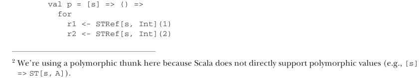

# Страница 0429
[<- Страница 0428](./page-0428) | [Индекс страниц](./) | [Страница 0430 ->](./page-0430)

> Часть 4: Эффекты и I/O / Глава 14: Локальные эффекты и мутабельное состояние / 14.2 Тип данных для принуждения области видимости побочных эффектов / 14.2.3 Запуск действий с мутабельным состоянием

### 14.2.3 Запуск действий с мутабельным состоянием

К этому моменту вы, пацаны, наверное, уже просекли, что за дичь творится с этой монадой `ST`. План такой: юзаем `ST`, чтоб наваять вычисление, которое при запуске выделит локальное мутабельное состояние под задачу, поебётся с ним как надо, а потом выкинет эту хрень нахуй. Всё вычисление референциально прозрачное (referentially transparent), потому что мутабельщина приватная и строго локальная, но мы хотим это типами прибить гвоздями. Взять того же `STRef` — внутри у него мутабельный `var`, и система типов Скалы должна гарантировать, что мы ни хуя не вытащим этот `STRef` из действия `ST`. Иначе инвариант локальности накроется пиздецом, и референциальная прозрачность улетит в жопу. Так как же безопасно гонять эти `ST`-действия? Сначала надо отличать безопасные от тех, что взорвут всё к херам. Врубитесь в разницу этих типов:

- `ST[S, STRef[S, Int]]` (нельзя запускать)

- `ST[S, Int]` (полностью безопасно запускать)

Первый — это `ST`-действие, которое возвращает мутабельную ссылку, а второй — совсем другая песня. Значение типа `ST[S, Int]` — это чисто `Int`, хоть вычисление этого `Int` и могло включать локальную мутабельщину под капотом. Есть жирная уязвимость между ними: `STRef` завязан на тип `S`, а `Int` — похуй на него. Хотим запретить запуск типа `ST[S, STRef[S, A]]`, потому что это вывалит `STRef` наружу, и в общем-то любой `ST[S, T]`, где `T` зависит от `S`. А с другой стороны, очевидно же, что действие без утечки мутабельных объектов всегда можно гонять без риска. Если у нас чистое действие типа `ST[S, Int]`, то пихаем ему `S` — и вуаля, `Int` в кармане. И нам вообще насрать, что там за `S`, потому что мы его сразу выкинем в помойку. Такое действие запросто может быть полиморфным по `S`. Чтоб это воплотить, юзаем полиморфную функцию, которая представляет безопасные `ST`-действия — то есть полиморфные по `S`:

```scala
[s] => () => ST[s, A]
```

Это как две капли воды идея с полиморфной функцией из `translate` в 13-й главе. Значение типа `[s] => () => ST[s, A]` — это функция, которая жрёт тип `s` и шлёт `ST[s, A]`.[^2]

В прошлом разделе мы наобум впихнули `Nothing` как тип `S`. Давайте лучше завернём его в полиморфную функцию, сделаем полиморфным по `S` — и вообще не придётся ебаться с выбором `S`, его подставит тот, кто вызовет эту хрень:



```scala
val p = [s] => () =>
  for
    r1 <- STRef[s, Int](1)
    r2 <- STRef[s, Int](2)
```

[^2]: Мы юзаем полиморфный thunk (thunk — отложенное вычисление), потому что Скала не поддерживает полиморфные значения напрямую (типа `[s] => ST[s, A]`).

[<- Страница 0428](./page-0428) | [Индекс страниц](./) | [Страница 0430 ->](./page-0430)
