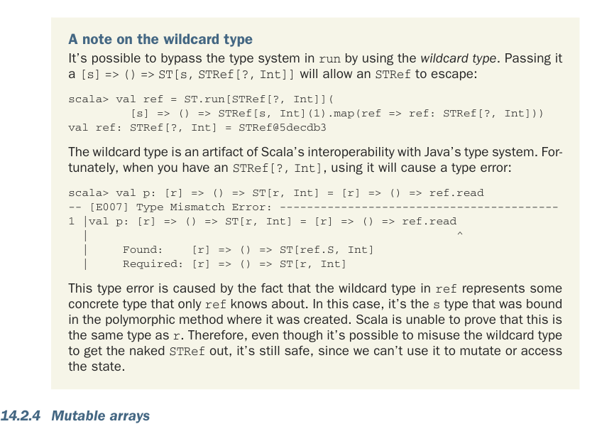

# Страница 0431

[<- Страница 0430](./page-0430) | [Указатель страниц](./) | [Страница 0432 ->](./page-0432)

> Часть 4: Эффекты и I/O / Глава 14: Локальные эффекты и мутабельное состояние / 14.2 Тип данных для принуждения области видимости сайд-эффектов / 14.2.4 Мутабельные массивы

```scala
|
ST[Nothing,
|
STRef[Nothing, Int]
|
]
|
Required: [s] => () =>
|
ST[s,
|
STRef[Nothing, Int]
|
]
```

В этом примере мы наобум выбрали ``Nothing``, чтоб точку донести, хуй с ним. Главное тут — тип ``s`` привязывается жёстко в момент вызова полиморфной функции, и её можно гонять хоть по сто раз с разными типами, как на карусели. Этот тип мы заранее не просчитаем, пока не дернем функцию. А ``STRef`` всегда клеймён типом ``S`` от того самого ``ST``-действия, где он родился, — так что вырваться на волю ему хуй получится, как зэку из зоны. И Scala-типовая система это железно гарантирует, без поблажек! Как следствие, раз ты не можешь вытащить голый ``STRef`` из ``ST``-действия, значит, если у тебя такой ``STRef`` в руках, ты сидишь внутри того ``ST``-действия, которое его слепило, — мутай референс на здоровье, безопасно, как в бункере.



Заметка про wildcard-тип (wildcard type). Можно обойти типовую систему в ``run`` с помощью этого долбаного *wildcard-типа* (wildcard type), наследия Java-совместимости. Если скормить ему ``[s] => () => ST[s, STRef[?, Int]]``, то ``STRef`` выскользнет наружу, как таракан из щели:

```scala
scala> val ref = ST.run[STRef[?, Int]](
[s] => () => STRef[s, Int](1).map(ref => ref: STRef[?, Int]))
val ref: STRef[?, Int] = STRef@5decdb3
```

Wildcard-тип (wildcard type) — чисто артефакт Scala-адаптации под Java-типы, чтоб не ебаться с интеграцией. К счастью, когда у тебя ``STRef[?, Int]``, попытка его юзнуть выдаст ошибку типов, и правильно сделает:

```scala
scala> val p: [r] => () => ST[r, Int] = [r] => () => ref.read
-- [E007] Type Mismatch Error: -----------------------------------------
1 |val p: [r] => () => ST[r, Int] = [r] => () => ref.read
|
^
|
Found:
[r] => () => ST[ref.S, Int]
|
Required: [r] => () => ST[r, Int]
```

Эта ошибка типов вылазит потому, что wildcard в ``ref`` маскирует какой-то конкретный тип, о котором в курсе только ``ref``. Тут это ``s``-тип, который привязался в полиморфном методе при рождении. Scala не может доказать, что это один хуй с ``r`` — ну и ладно, пусть компилятор параноит. Короче, хоть и можно накосячить с wildcard'ом и вытащить голый ``STRef``, но толку ноль: мутировать или читать состояние им не выйдет, типы стоят стеной, как в Скалли.

### 14.2.4 Мутабельные массивы

Одиночные mutable-референсы (mutable references) сами по себе — хуйня полная, не особо годятся для реальной работы. А вот mutable-массивы (mutable arrays) — это уже мясо, идеальный кейс для ``ST``-монды, чтоб почувствовать кайф. В этой секции слепим алгебру для ковыряния mutable-массивов внутри ``ST``-монды и напишем in-place (на месте) ``quicksort``-алгоритм чисто композиционно, без говнокода. Нам нужны примитивные комбинаторы: аллоцировать, читать и писать в эти массивы.

[<- Страница 0430](./page-0430) | [Указатель страниц](./) | [Страница 0432 ->](./page-0432)
