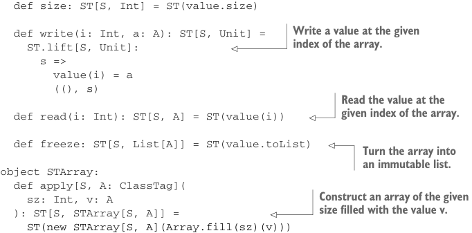

# Страница 0432
[<- Страница 0431](./page-0431) | [Индекс страниц](./) | [Страница 0433 ->](./page-0433)

> Часть 4: Эффекты и I/O / Глава 14: Локальные эффекты и мутабельное состояние / 14.2 Тип данных для принуждения скоупа побочек / 14.2.4 Мутабельные массивы

## 403 14.2 Тип данных для принуждения скоупа побочных эффектов

Listing 14.3 Класс массива для нашей `ST` монады

```scala
final class STArray[S, A] private (private var value: Array[A]):
```



```scala
def size: ST[S, Int] = ST(value.size)
```

> Записать значение по индексу в массив. Как в гараже гвоздь забить — чётко и без пыли.

```scala
def write(i: Int, a: A): ST[S, Unit] =
ST.lift[S, Unit]:
s =>
value(i) = a
((), s)
```

> Вытащить значение по индексу из массива. Не тронешь — не узнаешь, что там за хуйня прячется.

```scala
def read(i: Int): ST[S, A] = ST(value(i))
def freeze: ST[S, List[A]] = ST(value.toList)
```

> Слить массив в неизменяемый список. Типа, мутабельный пёс на цепи — вышел, стал лисой.

```scala
object STArray:
def apply[S, A: ClassTag](
sz: Int, v: A
): ST[S, STArray[S, A]] =
```

> Слепить массив заданного размера, набитый значением `v`. Как фабрика штампует одинаковые болты.

```scala
ST(new STArray[S, A](Array.fill(sz)(v)))
```

Короче, Scala не слепит массивы для любого типа `A` на автомате — требует `ClassTag[A]` инстанс в скоупе, мы его впихиваем через `A:` `ClassTag` контекст-байнд, чтоб не ебаться. Стдлиб кидает class tags для примитивам и базовых типов. Как с `STRef` — всегда возвращаем `STArray` в обёртке `ST` с типом `S`, и любой трёп массива (даже рид) — чистый `ST`-экшн с тем же `S` тэгом. Голый `STArray` наружу не вылезет за пределы `ST` монады (кроме как из самого исходника Scala-файла с `STArray`). Это как цепной пёс в FP-раю: рычит, но не кусает без команды. На этих примитивах уже можно городить сложные функции над массивами, пацаны.


#### УПРАЖНЕНИЕ 14.1

Допилите комбинатор на `STArray`, чтоб массив из `Map` набить: ключ — индекс, значение — туда и хуярь. Например, `xs.fill(Map(0->"a",` `2->"b"))` должно вписать `"a"` на индекс `0` в `xs`, а `"b"` — на `2`. Только существующими примитивами ковыряйтесь, без самодеятельности, как на код-ревью велено:

```scala
def fill(xs: Map[Int, A]): ST[S, Unit]
```

Не всё прокатит шустро на этих комбинаторах, блядь. Скажем, из листа в массив — в Scala-либе уже годно оптимизировано под жопу. Давайте и это примитивом сделаем, чтоб не изобретать велосипед заново:

[<- Страница 0431](./page-0431) | [Индекс страниц](./) | [Страница 0433 ->](./page-0433)
