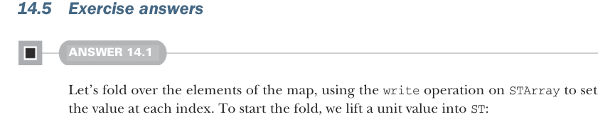

# Страница 0437

[<- Страница 0436](./page-0436) | [Индекс страниц](./) | [Страница 0438 ->](./page-0438)

> Часть 4: Эффекты и ввод-вывод / Глава 14: Локальные эффекты и мутабельное состояние / 14.5 Ответы на упражнения

### Итог

- Невидимая мутация — это пиздец как валидный приём реализации в функциональном программировании, пацаны, не ссыте.
- Система типов Scala достаточно выразительная, чтоб вычислять кучу типов эффектов, как рентген на код-ревью.
- Тип данных `ST` позволяет трекать эффект мутации какого-нибудь shared state строго в локальном скоупе, чтоб не разъебалось всё к хуям.
- Тип `STRef` даёт возможность аллоцировать, читать и писать в мутабельную ячейку — классика, через которую все мы прошли.
- Тип `STArray` позволяет аллоцировать, читать и писать в мутабельный массив, чтоб не ковыряться в var'ах как в 2005-м.
- И `STRef`, и `STArray` возвращают действия `ST` на каждый доступ и мутацию, гарантируя, что всё остаётся в рамках того же самого действия `ST` — никаких побегов, как в тюрьме FP.
- Выбор, какие эффекты трекать, — это вопрос суждения по нуждам проги; фокусируйся на тех, от которых зависит корректность, а не на всякой хуйне.



### 14.5 Ответы на упражнения

#### РЕШЕНИЕ 14.1

Давай сворачиваем элементы мапы через fold, юзая операцию `write` на `STArray`, чтоб засетить значение по каждому индексу — как разложить покерные карты по карманам. А чтоб завести этот фолд, лифтим unit'овку в `ST`, чтоб не с нуля начинать:

```scala
def fill(xs: Map[Int, A]): ST[S, Unit] =
xs.foldRight(ST[S, Unit](())):
case ((k, v), st) => st.flatMap(_ => write(k, v))
```


#### РЕШЕНИЕ 14.2

Портируем оригинальное определение `partition` (partition), заменяя каждый доступ и апдейт массива на эквивалент на `STArray` — прям как рефакторинг из imperative ада в FP-рай. Оригинал юзал `var` `j`, которую меняем на `STRef`, и вуаля, мутация под контролем:

```scala
def partition[S](
a: STArray[S, Int], l: Int, r: Int, pivot: Int
): ST[S, Int] =
for
vp <- a.read(pivot)
_ <- a.swap(pivot, r)
j <- STRef(l)
_ <- (l until r).foldLeft(ST[S, Unit](()))((s, i) =>
for
_ <- s
vi <- a.read(i)
_
<- if vi < vp then
```

[<- Страница 0436](./page-0436) | [Индекс страниц](./) | [Страница 0438 ->](./page-0438)
