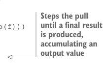
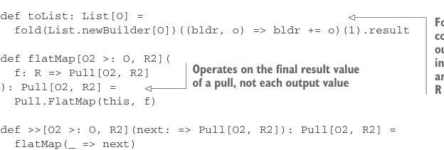
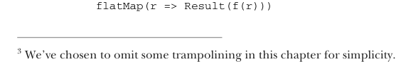

# Страница 0443

[<- Страница 0442](./page-0442) | [Указатель страниц](./) | [Страница 0444 ->](./page-0444)

> Часть 4: Эффекты и I/O / Глава 15: Обработка потоков и инкрементальный I/O / 15.2 Простые трансформации потоков

### 15.2 Простые трансформации потоков

Первый шаг, чтоб вернуть себе тот самый высокоуровневый дзен из `Lazy-`, `List` и `List`, даже когда копаемся в этой I/O-хуйне, — ввести *процессоры потоков*. Процессор потока — это как конвейер на фабрике: берёт один поток и лепит из него другой, без лишней суеты. Слово *поток* тут в самом широком смысле, пацаны: последовательность данных, которая может генериться лениво, как ленивый кот, или сыпаться извне — строки из файла, HTTP-запросы, координаты кликов мыши или любая другая херня. Давайте разберём простой типчик `Pull`, который позволит нам такие трансформации выражать без геморроя.³

Листинг 15.2 Тип данных `Pull`

```scala
enum Pull[+O, +R]:
case Result[+R](result: R) extends Pull[Nothing, R]
case Output[+O](value: O) extends Pull[O, Unit]
case FlatMap[X, +O, +R](
source: Pull[O, X],
f: X => Pull[O, R]) extends Pull[O, R]
```


> Интерпретирует pull, переписывая левосторонние вложенные flatMap — чтоб не плодить стектрейсы, как кроликов

```scala
def step: Either[R, (O, Pull[O, R])] = this match
case Result(r) => Left(r)
case Output(o) => Right(o, Pull.done)
case FlatMap(source, f) =>
source match
case FlatMap(s2, g) =>
s2.flatMap(x => g(x).flatMap(y => f(y))).step
case other => other.step match
case Left(r) => f(r).step
case Right((hd, tl)) => Right((hd, tl.flatMap(f)))
```



> Шагает по pull, пока не выдоит финальный результат, накапливая выходные значения — как сборщик урожая на бесконечном поле

```scala
@annotation.tailrec
final def fold[A](init: A)(f: (A, O) => A): (R, A) =
step match
case Left(r) => (r, init)
case Right((hd, tl)) => tl.fold(f(init, hd))(f)
```



```scala
def toList: List[O] =
fold(List.newBuilder[O])((bldr, o) => bldr += o)(1).result
```

> Сворачивает pull в один список всех выходных элементов, R-шку нахуй выкидывая — классический foldRight, но для ленивых ублюдков

```scala
def flatMap[O2 >: O, R2](
f: R => Pull[O2, R2]
): Pull[O2, R2] =
Pull.FlatMap(this, f)
```

> Работает с финальным значением pull, а не с каждым кусочком выхода — чтоб не путаться в мелочах

```scala
def >>[O2 >: O, R2](next: => Pull[O2, R2]): Pull[O2, R2] =
flatMap(_ => next)
def map[R2](f: R => R2]): Pull[O, R2] =
```



```scala
flatMap(r => Result(f(r)))
```

³ Мы тут для простоты отрезали трамполины — чтоб не усложнять, как в первый раз на проде без тестовой среды.

[<- Страница 0442](./page-0442) | [Указатель страниц](./) | [Страница 0444 ->](./page-0444)
