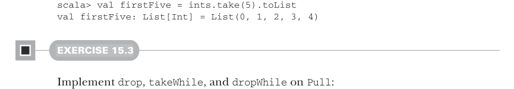

# Страница 0446

[<- Страница 0445](./page-0445) | [Указатель страниц](./) | [Страница 0447 ->](./page-0447)

> Часть 4: Эффекты и ввод-вывод / Глава 15: Обработка потоков и инкрементальный ввод-вывод (I/O) / 15.2 Простые трансформации потоков / 15.2.1 Создание pull'ов (Pull'ов)

## 417 15.2 Простые трансформации потоков

Пока что у нас нет способа частично просчитать pull (Pull), блять. А это пиздец как полезно для бесконечных потягушек, типа тех, что кидает `continually`, `repeat` или `iterate` — они же как чёрная дыра, жрут ресурсы вечно. 

Давай замутим `take(n)` на `Pull`, который будет шагать по pull, пока не насобирает ровно n элементов на выходе:

```scala
def take(n: Int): Pull[O, Option[R]] =
if n <= 0 then Result(None)
else step match
case Left(r) => Result(Some(r))
case Right((hd, tl)) => Output(hd) >> tl.take(n - 1)
```

Если `n` <= 0, то `take` просто сливает `Result(None)` — типа, "не судьба". 

Иначе шагаем: дошли до жопы ввода — оборачиваем финальный результат в `Some` и валим. Нет? Вытаскиваем значение, пускаем его в эфир, а на остатке рекурсивно `take(n-1)`. 

Но вот засада, пацаны: когда n > 0, мы жадно жрём исходный pull с ходу. А это как в проде запустить бесконечный цикл без брейка — неожиданно, потому что обычно pull'ы оживают только при `fold` (или `toList`, который на нём висит). 

Короче, отложим эту хуйню через свежий комбинатор на `Pull`:

```scala
def uncons: Pull[Nothing, Either[R, (O, Pull[O, R])]] =
Pull.done >> Result(step)
def take(n: Int): Pull[O, Option[R]] =
if n <= 0 then Result(None)
else uncons.flatMap:
case Left(r) => Result(Some(r))
case Right((hd, tl)) => Output(hd) >> tl.take(n - 1)
```

`uncons` просто оборачивает `step` в конструктор `Result` и маскирует создание под `flatMap` — лениво, как и положено в FP, чтоб не срать в память зря. 

В `take` теперь вместо матчинга на `step` флетмапим результат `uncons`. 

С таким арсеналом можно лепить частично вычисленные бесконечные стримы, не боясь, что оно улетит в космос:

```scala
scala> val ints = Pull.iterate(0)(_ + 1)
val ints: Pull[Int, Nothing] = FlatMap(Output(0),...)
```



```scala
scala> val firstFive = ints.take(5).toList
val firstFive: List[Int] = List(0, 1, 2, 3, 4)
```

#### УПРАЖНЕНИЕ 15.3

Замути `drop`, `takeWhile` и `dropWhile` на `Pull` — классика жанра, как в старом добром Java Streams, только без побочек и с ленью:

```scala
def drop(n: Int): Pull[O, R]
def takeWhile(p: O => Boolean): Pull[O, Pull[O, R]]
def dropWhile(p: O => Boolean): Pull[Nothing, Pull[O, R]]
```

[<- Страница 0445](./page-0445) | [Указатель страниц](./) | [Страница 0447 ->](./page-0447)
