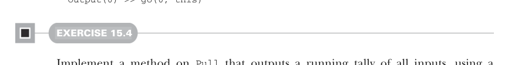
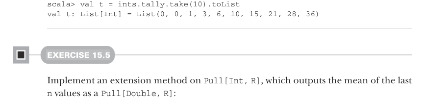

# Страница 0447

[<- Страница 0446](./page-0446)  
[Индекс страниц](./)  
[Страница 0448 ->](./page-0448)

> Часть 4: Эффекты и I/O / Глава 15: Обработка потоков и инкрементальный I/O / 15.2 Простые трансформации потоков / 15.2.1 Создание pull'ов (pull-based streams)

Мы можем слепить кучу годных трансформаций pull'ов, мешая рекурсивные функции с `uncons` (uncons — разбор на голову и хвост), как в старом добром tailrec'е (tail recursion, хвостовая рекурсия), чтоб не стекло ебало. Вот как перелопатить выходные элементы pull'а, чтоб он выдал свежак:

```scala
def mapOutput[O2](f: O => O2): Pull[O2, R] =
uncons.flatMap:
case Left(r) => Result(r)
case Right((hd, tl)) => Output(f(hd)) >> tl.mapOutput(f)
```

Тот же подход прокатит, чтоб добавлять или выкидывать элементы из pull'а на хуй. Вот комбинатор, который фильтрует выход по предикату — классика, как `grep` в юниксе, только FP-шный:

```scala
def filter(p: O => Boolean): Pull[O, R] =
uncons.flatMap:
case Left(r) => Result(r)
case Right((hd, tl)) =>
(if p(hd) then Output(hd) else Pull.done) >> tl.filter(p)
```

Даже состояние можно протащить через эти трансформации, пихая его аргументом в рекурсию — как аккумулятор в `foldLeft`, чтоб не терялось по пути, блядь:

```scala
def count: Pull[Int, R] =
def go(total: Int, p: Pull[O, R]): Pull[Int, R] =
p.uncons.flatMap:
case Left(r) => Result(r)
case Right((_, tl)) =>
val newTotal = total + 1
Output(newTotal) >> go(newTotal, tl)
Output(0) >> go(0, this)
```



#### УПРАЖНЕНИЕ 15.4

Забабахай метод на `Pull`, который будет выплевывать бегучий тотал всех входов, комбинируя их через монад. Каждый входной элемент мешаешь с накопленным счётом и выдаёшь результат — чтоб как счётчик в игре, тикает и растёт:

```scala
def tally[O2 >: O](using m: Monoid[O2]): Pull[O2, R]
```



```scala
scala> val t = ints.tally.take(10).toList
val t: List[Int] = List(0, 0, 1, 3, 6, 10, 15, 21, 28, 36)
```

#### УПРАЖНЕНИЕ 15.5

Забабахай extension-метод на `Pull[Int, R]`, который выдаёт среднее от последних `n` значений в виде `Pull[Double, R]` — типичный скользящий средняк (sliding window average), чтоб не лагало, как в трейдинге:

```scala
extension [R](self: Pull[Int, R])
def slidingMean(n: Int): Pull[Double, R]
```

[<- Страница 0446](./page-0446)  
[Индекс страниц](./)  
[Страница 0448 ->](./page-0448)
