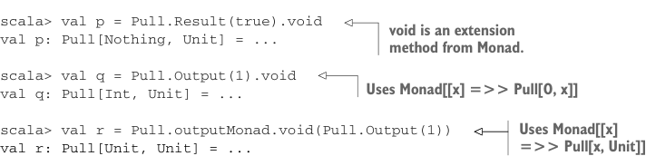
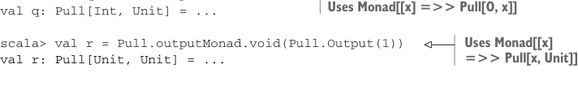
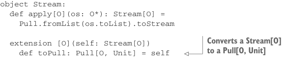

# Страница 0449
[<- Страница 0448](./page-0448) | [Индекс страниц](./) | [Страница 0450 ->](./page-0450)

> Часть 4: Эффекты и I/O / Глава 15: Обработка потоков и инкрементальный I/O / 15.2 Простые трансформации потоков / 15.2.1 Создание pull'ей

```scala
extension [O](self: Pull[O, Unit])
def flatMapOutput[O2](f: O => Pull[O2, Unit]): Pull[O2, Unit] =
self.uncons.flatMap:
case Left(()) => Result(())
case Right((hd, tl)) =>
f(hd) >> tl.flatMapOutput(f)
```

Мы берём этот чёртов оригинальный pull и uncons'им его нахуй — разбираем на голову и хвост. Если прилетел элемент вывода плюс остаток, то пихаем элемент в функцию, которую нам подсунули, варим из этого `Pull[O2,` `Unit]`. Возвращаем этот pull, а следом flatMapOutput'им остаток. Получается именно то поведение map-then-concat, которое мы и хотим, без лишней хуйни:

```scala
scala> val out = ints.flatMapOutput(i =>
Pull.fromList(List(i, i))).take(10).toList
val out: List[Int] = List(0, 0, 1, 1, 2, 2, 3, 3, 4, 4)
```

С такой реализацией мы можем подкинуть альтернативный экземпляр монады, чтоб не ебаться:

```scala
val outputMonad: Monad[[x] =>> Pull[x, Unit]] = new:
def unit[A](a: => A): Pull[A, Unit] = Output(a)
extension [A](pa: Pull[A, Unit])
def flatMap[B](f: A => Pull[B, Unit]): Pull[B, Unit] =
pa.flatMapOutput(f)
```

Это вполне законный экземпляр монады, но юзать его — как гвозди молотком забивать, сплошной геморрой. У нас уже есть given-инстанс `Monad[[x]` `=>>` `Pull[O,` `x]]`, так что чтоб переключиться на `Monad[[x]` `=>>` `Pull[x,` `Unit]]`, приходится либо явно тыкать в него пальцем, либо тащить в скоуп с приоритетом повыше, чтоб задавил обычный:



```scala
scala> val p = Pull.Result(true).void
val p: Pull[Nothing, Unit] = ...
```

> void — это extension method из Monad.

```scala
scala> val q = Pull.Output(1).void
val q: Pull[Int, Unit] = ...
```



> Юзает Monad[[x] =>> Pull[O, x]]

> Юзает Monad[[x] =>> Pull[x, Unit]]

```scala
scala> val r = Pull.outputMonad.void(Pull.Output(1))
val r: Pull[Unit, Unit] = ...
```

Вместо этого давай зафигачим opaque type alias для `Pull[O,` `Unit]` и привяжем к нему map-then-concat поведение — чтоб не париться с этими инстансами. Назовём эту прелесть `Stream`, потому что фиксируем конец pull'а на `Unit`, и весь фокус уходит на выходные значения, как в нормальном стриме, где хвост виляет:

```scala
opaque type Stream[+O] = Pull[O, Unit]
object Stream:
def apply[O](os: O*): Stream[O] =
Pull.fromList(os.toList).toStream
```



> Конвертит Stream[O] в Pull[O, Unit]

```scala
extension [O](self: Stream[O])
def toPull: Pull[O, Unit] = self
```

[<- Страница 0448](./page-0448) | [Индекс страниц](./) | [Страница 0450 ->](./page-0450)
